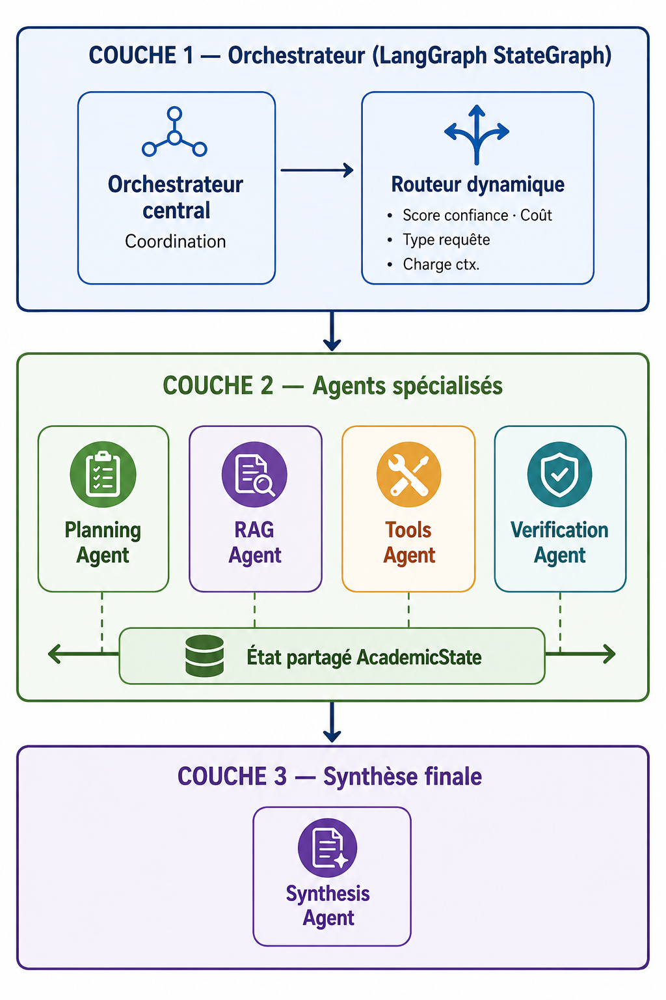
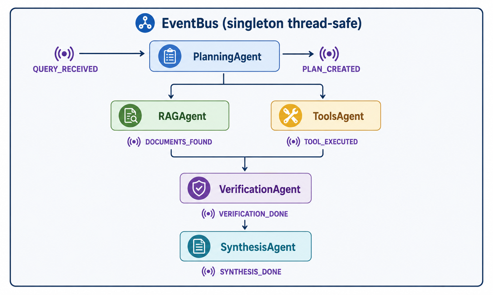

# AcademiMAS — Étude Comparative d'Architectures Multi-Agents pour l'Assistance Académique

>Système d’étude expérimental basé sur **LangGraph**, **LLMs locaux et distants**, et **ChromaDB**, développé dans le cadre d’une étude scientifique visant à comparer deux paradigmes d’architectures multi-agents : **hiérarchique** et **distribuée (peer-to-peer)**.

---

##  **Introduction**

Dans le cadre de ce projet de recherche, nous avons conçu et implémenté deux architectures multi-agents complètes afin d’étudier leurs performances dans un contexte d’assistance académique intelligente.

L’objectif est de réaliser une **étude expérimentale comparative rigoureuse** entre deux approches :

- une architecture **hiérarchique**, pilotée par un orchestrateur central,
- une architecture **distribuée**, basée sur la collaboration entre agents sans point de contrôle unique.

Les deux systèmes utilisent les mêmes modèles de langage (LLMs locaux et via API), les mêmes prompts, ainsi que les mêmes agents afin de garantir une comparaison équitable et scientifique.

---

##  Agents communs aux deux architectures

Les deux architectures étudiées reposent sur un ensemble **identique d’agents spécialisés**, afin de garantir une comparaison équitable et scientifiquement rigoureuse entre l’approche hiérarchique et l’approche distribuée.

Les agents utilisés dans les deux systèmes sont :

- **PlanningAgent**
- **RAGAgent**
- **ToolsAgent**
- **VerificationAgent**
- **SynthesisAgent**

Ainsi, la différence entre les deux architectures ne réside pas dans les agents eux-mêmes, mais uniquement dans leur **mode d’orchestration et de coordination**. Cette conception permet d’isoler l’impact de l’architecture sur les performances globales du système.


##  Resources

Afin de pouvoir réaliser ce travail dans de bonnes conditions, nous avons constitué et utilisé plusieurs ressources essentielles dans le cadre de cette étude comparative.

###  Dataset d’évaluation

Un ensemble de **160 questions** de différents types et catégories a été collecté et utilisé pour évaluer les deux architectures (hiérarchique et distribuée).  
Chaque question est injectée dans les deux systèmes afin de produire **deux sorties distinctes**, permettant une comparaison directe.

###  Données collectées

Pour chaque requête, plusieurs métriques ont été enregistrées afin d’analyser finement les performances des systèmes :

- `question_id`
- `timestamp`
- `question_raw`
- `question_length`
- `nb_mots`
- `domaine_detecte`
- `type_question`
- `temps_ms`
- `tokens_total`
- `tokens_prompt`
- `tokens_completion`
- `nb_agents`
- `nb_outils`
- `reponse`
- `score_hallucination`
- `score_outils`
- `score_qualite`
- `score_global`
- `notes_annotateur`

Ces données permettent d’évaluer les systèmes selon plusieurs dimensions : **performance temporelle**, **coût en tokens**, **qualité des réponses**, et **niveau d’hallucination des modèles**.

### Liens des ressources

- Questions d’étude :  
  https://drive.google.com/file/d/1KxcRF8VK9NqW_yjPUW-WgKlcsN5eL6b4/view?usp=drive_link

- Dataset architecture hiérarchique :  
  https://drive.google.com/file/d/1dcOwou6JVUA68kl5kPCj0jiz2jEOUPop/view?usp=drive_link

- Dataset architecture distribuée :  
  https://drive.google.com/file/d/1HHVlSkyogRWjRE2g1GrIuNCG4xcSZ1sb/view?usp=drive_link

- Notebook du travail :  
  https://drive.google.com/file/d/1FDWvlUyVW47MFLkkxf3gtsI1Q7Rd7Zs3/view?usp=drive_link

- Meilleur modèle retenu :  
  https://drive.google.com/file/d/1WbaPRPV0YPI0Ex_daTexzFJF0g5arV27/view?usp=drive_link
---

## Table des matières

1. [Objectif de recherche](#objectif-de-recherche)
2. [Vue d'ensemble du système](#vue-densemble-du-système)
3. [Architecture hiérarchique](#architecture-hiérarchique)
4. [Architecture distribuée peer-to-peer](#architecture-distribuée-peer-to-peer)
5. [Routeur méta-architectural (Meta-Router)](#routeur-méta-architectural-meta-router)
6. [Les agents et leurs rôles](#les-agents-et-leurs-rôles)
7. [Communication entre agents (A2A)](#communication-entre-agents-a2a)
8. [Mémoire : session et persistante](#mémoire--session-et-persistante)
9. [Serveur MCP](#serveur-mcp)
10. [Scalabilité — ajouter / retirer un agent](#scalabilité--ajouter--retirer-un-agent)
11. [Métriques et évaluation scientifique](#métriques-et-évaluation-scientifique)
12. [Installation et lancement](#installation-et-lancement)
13. [Structure du projet](#structure-du-projet)

---

##  **Objectif de recherche**

AcademiMAS est avant tout un **banc d’essai scientifique**. Son objectif est de produire un **article de recherche** répondant à la question suivante :

> *Pour un ensemble de questions  données, quelle architecture multi-agents — hiérarchique  ou distribuée peer-to-peer — produit les réponses les plus précises, les plus cohérentes et dans les délais les plus raisonnables ?*

Pour répondre à cette question, le système implémente **deux architectures uniquement** (hiérarchique et distribuée), exécutées en parallèle sur les mêmes requêtes afin de garantir une comparaison équitable. Les performances sont ensuite analysées à l’aide de métriques quantitatives et qualitatives.

###  **Question centrale de l’étude** ❓

> *Peut-on prédire directement, à partir de la requête utilisateur, quelle architecture (hiérarchique ou distribuée) produira la meilleure réponse, en utilisant un modèle d’apprentissage supervisé ?*

Cette question vise à évaluer la possibilité de construire un **modèle de routage intelligent** capable de sélectionner dynamiquement l’architecture optimale en fonction des caractéristiques de la requête.

### **Questions de recherche principales**

| # | Question | Métriques clés |
|---|---|---|
| Q1 | Quelle architecture offre la meilleure qualité de réponse ? | `confidence_score`, `quality_score` |
| Q2 | Quelle architecture est la plus rapide selon les types de questions ? | `total_latency_ms`, complexité de la requête |
| Q3 | Quelle architecture est la plus robuste face aux erreurs ? | `taux_d_echec`, erreurs |
| Q4 | Le routeur méta-architectural prédit-il correctement l’architecture optimale ? | `accuracy` du Meta-Router |
| Q5 | Les décisions de routage sont-elles stables et reproductibles ? | variance sur N requêtes identiques |

## Vue d'ensemble du système


Les deux architectures partagent **les mêmes agents** (même logique métier, même code `process()`). Seule la **topologie de coordination** diffère. Cela garantit que les différences observées sont imputables à l'architecture, pas aux modèles ou aux prompts.

---

## Architecture hiérarchique

### Principe

L'architecture hiérarchique repose sur un **orchestrateur central** (LangGraph `StateGraph`) qui contrôle explicitement le flux d'exécution des agents. Chaque décision — quel agent appeler, dans quel ordre, selon quelle condition — est prise par cet orchestrateur.



### Flux d'exécution

```
Requête → PlanningAgent → [RAGAgent] → [ToolsAgent] → [VerificationAgent] → SynthesisAgent → Réponse
```

Les crochets `[]` indiquent les agents activés conditionnellement par le routeur dynamique interne.

### Caractéristiques

| Propriété | Valeur |
|---|---|
| Coordinateur | Orchestrateur LangGraph centralisé |
| Communication | État partagé `AcademicState` (TypedDict) |
| Ordre d'exécution | Séquentiel, déterministe |
| Décision de routage | Routeur interne basé sur patterns regex + heuristiques |
| Reprise sur erreur | Point de contrôle unique (orchestrateur) |
| Fichier principal | `backend/orchestrator.py` |

### Avantages attendus (à valider empiriquement)

- Traçabilité maximale : chaque décision est loggée
- Cohérence garantie par le contrôle centralisé
- Détection d'erreur simplifiée
- Coût réduit grâce au routage sélectif

---

## Architecture distribuée peer-to-peer

### Principe

L'architecture distribuée supprime l'orchestrateur central. Les agents sont **autonomes** et réagissent à des **événements** publiés sur un bus partagé (`EventBus`). Chaque agent s'abonne aux événements qui le concernent et publie son résultat comme un nouvel événement.



### Types d'événements

| Événement | Émis par | Déclenche |
|---|---|---|
| `QUERY_RECEIVED` | PeerToPeerRunner | PlanningAgent |
| `PLAN_CREATED` | PlanningAgent | RAGAgent, ToolsAgent |
| `DOCUMENTS_FOUND` | RAGAgent | ToolsAgent, VerificationAgent |
| `TOOL_EXECUTED` | ToolsAgent | VerificationAgent |
| `VERIFICATION_DONE` | VerificationAgent | SynthesisAgent |
| `SYNTHESIS_DONE` | SynthesisAgent | (fin du pipeline) |
| `ERROR` | N'importe quel agent | (débloque le wait) |

### Composants clés

#### EventBus (`backend/distributed/event_bus.py`)

Bus d'événements thread-safe implémenté comme singleton. Il maintient :
- Un registre de subscribers par type d'événement
- Un état agrégé par session (accumulation des sorties de chaque agent)
- Des `threading.Event` pour que le runner puisse attendre sans polling actif

```python
# Publier un événement
bus.publish(Event(
    type=EventType.PLAN_CREATED,
    payload={"plan": "...", "user_query": "..."},
    source="PlanningAgent",
    session_id="session-xyz",
))

# S'abonner à un type d'événement
bus.subscribe(EventType.PLAN_CREATED, my_callback)

# Lire l'état agrégé d'une session
state = bus.get_state("session-xyz")
```

#### DistributedAgentWrapper (`backend/distributed/distributed_agents.py`)

Chaque agent existant est encapsulé dans un wrapper générique qui :
1. S'abonne aux événements déclencheurs (`trigger_events`)
2. Reconstruit un `AcademicState` complet depuis l'état du bus
3. Appelle `agent.process(state)` **sans modification** de la logique métier
4. Publie le résultat comme nouvel événement (`output_event`)

```python
class DistributedRAGAgent(DistributedAgentWrapper):
    trigger_events = [EventType.PLAN_CREATED]
    output_event   = EventType.DOCUMENTS_FOUND

    def _extract_payload(self, result, state):
        return {"retrieved_docs": result.get("retrieved_docs", "")}
```

Un mécanisme de **throttling** (délai minimum entre deux appels LLM pour la même session) est intégré pour respecter les rate limits de l'API Anthropic.

#### PeerToPeerRunner (`backend/distributed/p2p_runner.py`)

Point d'entrée du pipeline P2P. Il instancie les agents une seule fois, les enregistre sur le bus, publie `QUERY_RECEIVED`, puis attend `SYNTHESIS_DONE` (avec timeout de 180 secondes). Le format de retour est **identique** à celui de l'architecture hiérarchique pour faciliter la comparaison.

### Caractéristiques

| Propriété | Valeur |
|---|---|
| Coordinateur | Aucun — les agents réagissent aux événements |
| Communication | EventBus publish/subscribe |
| Ordre d'exécution | Réactif, parallèle possible selon le graphe d'événements |
| Décision de routage | Implicite (topologie des abonnements) |
| Reprise sur erreur | Publication d'un événement `ERROR` |
| Fichier principal | `backend/distributed/p2p_runner.py` |

### Avantages attendus (à valider empiriquement)

- Découplage total entre agents
- Parallélisme naturel (ex. RAGAgent et ToolsAgent déclenchés simultanément)
- Extensibilité : ajouter un agent = s'abonner à un événement
- Résilience : un agent défaillant n'arrête pas les autres

---

## Routeur méta-architectural (Meta-Router)

### Rôle

Le Meta-Router est le composant central de l’étude expérimentale.  
Il analyse la requête utilisateur et **sélectionne automatiquement l’une des deux architectures disponibles** :

- **Hiérarchique**
- **Distribuée (peer-to-peer)**

afin de maximiser la qualité de la réponse, la cohérence et la performance globale du système.

Il s’agit d’un **modèle d’apprentissage supervisé** (pipeline ML de classification) entraîné à partir des données collectées lors de l’évaluation comparative des deux architectures.

---
### **Signaux de décision utilisés**

| Signal | Description | Exemple |
|--------|------------|---------|
| **Complexité de la requête** | Niveau de raisonnement requis | Multi-étapes → hiérarchique |
| **Besoin de parallélisme** | Recherche multi-sources indépendantes | Exploration large → distribuée |
| **Structure de la tâche** | Séquentiel vs collaboratif | Raisonnement logique → hiérarchique |
| **Contraintes de latence** | Temps de réponse attendu | Question simple → distribuée |
| **Patterns appris** | Historique des performances | Données expérimentales |

---

### **Mode d’évaluation scientifique**

Dans le cadre de l’étude, le système peut également fonctionner en mode expérimental :

- Les deux architectures sont exécutées sur les mêmes requêtes  
- Les résultats sont comparés a posteriori  
- Les métriques (latence, qualité, hallucination, score global) sont enregistrées  
- Ces données servent à améliorer le modèle du Meta-Router  

---

###  **Point clé**

Le Meta-Router ne représente pas une troisième architecture.  
Il fait partie du même pipeline unifié et agit uniquement comme un **sélecteur intelligent entre deux architectures existantes**, basé sur un apprentissage supervisé.


## Les agents et leurs rôles

Les cinq agents suivants sont partagés par les deux architectures. Leur logique métier (`process()`) est identique.

### 1. PlanningAgent (`planning`)

**Rôle** : Analyse la question et produit un plan d'action structuré.

- Décompose la question en sous-tâches ordonnées
- Estime la complexité : `low` / `medium` / `high`
- Détermine si RAG et/ou outils sont nécessaires

**Modèle** : `claude-3-5-haiku-20241022`

**Sortie** : `state["plan"]`

---

### 2. RAGAgent (`rag`)

**Rôle** : Retrieval-Augmented Generation — recherche dans la base documentaire académique.

- Requête vectorielle dans ChromaDB (cosine similarity)
- Enrichit la requête avec le plan du PlanningAgent
- Retourne les passages les plus pertinents avec scores de similarité

**Modèle** : `claude-3-5-haiku-20241022`

**Stockage** : ChromaDB persistant (`./data/chroma_db`)

**Sortie** : `state["retrieved_docs"]`

**Ajouter un document** :
```python
from backend.agents.registry import registry
rag = registry.get("rag")
rag.add_document(content="...", source="Mon livre, p.42")
```

---

### 3. ToolsAgent (`tools`)

**Rôle** : Exécution d'outils externes.

| Outil | Description |
|---|---|
| `calculator` | Expressions mathématiques |
| `python_executor` | Code Python sandboxé |
| `wikipedia_search` | Résumés Wikipedia FR/EN |

**Modèle** : `claude-3-5-haiku-20241022`

**Sortie** : `state["tool_results"]`

---

### 4. VerificationAgent (`verification`)

**Rôle** : Gardien de la qualité — détecte incohérences et hallucinations potentielles.

- Produit un score de confiance [0, 1]
- Émet une recommandation : `PROCEED` / `RETRY` / `FALLBACK`

**Modèle** : `claude-3-5-haiku-20241022`

**Sortie** : `state["verification_report"]`

```json
{
  "confidence_score": 0.87,
  "consistency_check": "Cohérent",
  "potential_hallucinations": [],
  "recommendation": "PROCEED",
  "quality_score": 0.85
}
```

---

### 5. SynthesisAgent (`synthesis`)

**Rôle** : Agrégateur final — combine toutes les sorties en réponse académique structurée.

- Intègre plan + docs RAG + résultats outils + rapport de vérification
- Structure la réponse en Markdown académique
- Bascule en mode FALLBACK si `confidence < 0.6`

**Modèle** : `claude-3-5-sonnet-20241022` (plus puissant pour la synthèse)

**Sortie** : `state["final_answer"]`

---

## Communication entre agents (A2A)

### Dans l'architecture hiérarchique

Les agents communiquent via l'**état partagé LangGraph** (`AcademicState`).

```
PlanningAgent → state["plan"] → RAGAgent, VerificationAgent, SynthesisAgent
RAGAgent      → state["retrieved_docs"] → VerificationAgent, SynthesisAgent
ToolsAgent    → state["tool_results"]   → VerificationAgent, SynthesisAgent
VerificationAgent → state["verification_report"] → SynthesisAgent
```

### Dans l'architecture distribuée

Les agents communiquent via des **événements publiés sur l'EventBus**. L'état est reconstruit à partir de l'état agrégé du bus avant chaque appel à `process()`.

### Structure de l'état partagé

```python
class AcademicState(TypedDict):
    messages: Annotated[List[BaseMessage], add_messages]
    user_query: str
    session_id: str
    router_decision: RouterDecision
    plan: str
    retrieved_docs: str
    tool_results: str
    verification_report: Dict
    final_answer: str
    agent_results: List[AgentResult]
    errors: List[str]
```

---

## Mémoire : session et persistante

### Mémoire de session (`SessionMemory`)

- **Type** : In-memory Python dict
- **Durée de vie** : durée du processus serveur
- **Capacité** : 20 derniers tours par session
- **Usage** : maintenir la cohérence conversationnelle

### Mémoire persistante (`PersistentMemory`)

- **Type** : SQLite (`./data/memory.db`)
- **Durée de vie** : permanente (survit aux redémarrages)
- **Usage** : historique complet, statistiques comparatives, données pour l'article

```sql
CREATE TABLE conversations (
    id           INTEGER PRIMARY KEY,
    session_id   TEXT,
    run_id       TEXT,
    query        TEXT,
    answer       TEXT,
    agents_used  TEXT,
    confidence   REAL,
    latency_ms   REAL,
    architecture TEXT,   -- "hierarchical" | "p2p"
    timestamp    TEXT,
    metadata     TEXT
);
```

**Accès** :
```python
from backend.memory.memory_manager import memory_manager

history = memory_manager.persistent.get_session_history("session-id", limit=10)
stats = memory_manager.get_stats()
# → {"total_conversations": 42, "avg_confidence": 0.84, "avg_latency_ms": 3200}
```

---

## Serveur MCP

Le module `backend/mcp/__init__.py` implémente un serveur **Model Context Protocol** léger.

**Outils MCP pré-enregistrés** :
- `latex_formatter` : formate une expression en LaTeX
- `citation_formatter` : génère une citation APA

**Ajouter un outil MCP** :
```python
from backend.mcp import mcp_server

mcp_server.register_tool(
    name="my_tool",
    fn=lambda input: f"résultat: {input}",
    description="Description de l'outil",
    input_schema={"type": "string"},
)
```

**Manifest MCP** (endpoint `/api/tools/manifest`) :
```json
{
  "tools": [
    {"name": "latex_formatter", "description": "...", "inputSchema": {...}},
    {"name": "citation_formatter", "description": "...", "inputSchema": {...}}
  ],
  "version": "1.0",
  "protocol": "MCP/1.0"
}
```

---

## Scalabilité — ajouter / retirer un agent

### ✅ Ajouter un agent (3 étapes)

**Étape 1** : Créer le fichier agent

```python
# backend/agents/my_agent.py
from backend.agents.base import BaseAgent
from backend.state import AcademicState

class MyAgent(BaseAgent):
    name = "my_agent"
    description = "Ce que fait mon agent."

    def process(self, state: AcademicState) -> dict:
        return {"tool_results": "Mon résultat"}
```

**Étape 2** : Enregistrer dans le registry (hiérarchique)

```python
from backend.agents.my_agent import MyAgent
from backend.agents.registry import registry

registry.register(MyAgent())
orchestrator.rebuild_graph()
```

**Étape 3** : Créer le wrapper distribué (P2P)

```python
# backend/distributed/distributed_agents.py
class DistributedMyAgent(DistributedAgentWrapper):
    trigger_events = [EventType.PLAN_CREATED]
    output_event   = EventType.TOOL_EXECUTED  # ou un nouvel EventType

    def _extract_payload(self, result, state):
        return {"tool_results": result.get("tool_results", "")}
```

### ❌ Retirer un agent

```python
# Hiérarchique
registry.unregister("my_agent")
orchestrator.rebuild_graph()

# P2P : supprimer le wrapper du PeerToPeerRunner
```

---

## Métriques et évaluation scientifique

### Métriques collectées par run

| Métrique | Source | Description |
|---|---|---|
| `latency_ms` | Tous les agents | Temps d'exécution par agent |
| `total_latency_ms` | Runner | Temps total de bout en bout |
| `confidence_score` | VerificationAgent | Score global [0, 1] |
| `quality_score` | VerificationAgent | Qualité perçue [0, 1] |
| `consistency_check` | VerificationAgent | Cohérent / Partiel / Incohérent |
| `architecture` | Runner | `"hierarchical"` ou `"p2p"` |
| `tokens.total_tokens` | Tous les agents | Consommation totale de tokens |
| `errors` | Runner | Liste des erreurs rencontrées |

### Endpoint statistiques

```
GET /api/stats
→ {
    "total_conversations": 42,
    "by_architecture": {
      "hierarchical": { "count": 21, "avg_confidence": 0.84, "avg_latency_ms": 3200 },
      "p2p":          { "count": 21, "avg_confidence": 0.87, "avg_latency_ms": 2700 }
    },
    "meta_router_accuracy": 0.76
  }
```

### Protocole expérimental recommandé

Pour construire un corpus d'évaluation robuste :

1. **Catégoriser les questions** : factuelles, calculatoires, multi-sources, raisonnement complexe.
2. **Exécuter chaque question N=10 fois** sur les deux architectures pour mesurer la variance.
3. **Annoter manuellement** la qualité des réponses (ou utiliser un LLM-judge).
4. **Calculer les deltas** : `Δconfidence`, `Δlatency`, `Δquality` par catégorie.
5. **Entraîner le Meta-Router** sur ces données et mesurer son accuracy.

---

## Installation et lancement

## Installation et exécution

Clonez le dépôt GitHub :
git clone https://github.com/hinimdoumorsia/Architecture-d-etude-multi-agents.git
 remplacer le username :hinimdoumorsia par votre user name et donc vous aurez le projet chez vous en local.
 
### Prérequis

- Python 3.10+
- Clé API Anthropic

### Backend

```bash
# 1. Cloner et configurer
cd academic-mas
cp .env.example .env
# Éditer .env : ajouter ANTHROPIC_API_KEY=sk-ant-...

# 2. Installer les dépendances Python
pip install -r requirements.txt

# 3. Lancer le serveur FastAPI
python -m uvicorn backend.main:app --reload --port 8000
```

Le serveur sera disponible sur `http://localhost:8000`.
Documentation API interactive : `http://localhost:8000/docs`

### Ajouter des documents à la base RAG

```bash
curl -X POST http://localhost:8000/api/documents \
  -H "Content-Type: application/json" \
  -d '{
    "content": "Le théorème de Bayes stipule que P(A|B) = P(B|A) * P(A) / P(B)...",
    "source": "Cours de probabilités, Chapitre 3"
  }'
```

### Lancer une requête sur chaque architecture

```bash
# Architecture hiérarchique
curl -X POST http://localhost:8000/api/query \
  -H "Content-Type: application/json" \
  -d '{"query": "Explique le théorème de Bayes avec un exemple.", "architecture": "hierarchical"}'

# Architecture distribuée P2P
curl -X POST http://localhost:8000/api/query \
  -H "Content-Type: application/json" \
  -d '{"query": "Explique le théorème de Bayes avec un exemple.", "architecture": "p2p"}'

# Mode comparaison (les deux en parallèle)
curl -X POST http://localhost:8000/api/query \
  -H "Content-Type: application/json" \
  -d '{"query": "Explique le théorème de Bayes avec un exemple.", "architecture": "compare"}'
```

---

## Structure du projet

```
academic-mas/
│
├── backend/
│   ├── main.py                      # Serveur FastAPI
│   ├── orchestrator.py              # LangGraph StateGraph (hiérarchique)
│   ├── state.py                     # AcademicState (état partagé)
│   │
│   ├── agents/
│   │   ├── base.py                  # BaseAgent (classe abstraite)
│   │   ├── registry.py              # AgentRegistry (scalabilité)
│   │   ├── planning_agent.py        # Agent 1 : Planification
│   │   ├── rag_agent.py             # Agent 2 : Retrieval / RAG
│   │   ├── tools_agent.py           # Agent 3 : Outils / MCP
│   │   ├── verification_agent.py    # Agent 4 : Vérification
│   │   ├── synthesis_agent.py       # Agent 5 : Synthèse finale
│   │   └── example_custom_agent.py  # Template pour nouveaux agents
│   │
│   ├── distributed/                 # Architecture P2P
│   │   ├── event_bus.py             # Bus d'événements thread-safe
│   │   ├── distributed_agents.py    # Wrappers P2P des agents existants
│   │   └── p2p_runner.py            # Point d'entrée du pipeline P2P
│   │
│   ├── meta_router/                 # Routeur méta-architectural
│   │   └── meta_router.py           # Sélection hiérarchique vs P2P
│   │
│   ├── memory/
│   │   └── memory_manager.py        # Session + persistante (SQLite)
│   │
│   ├── mcp/
│   │   └── __init__.py              # Serveur MCP local
│   │
│   └── utils/
│       └── router.py                # Routeur interne (hiérarchique)
│
├── data/                            # Créé automatiquement
│   ├── chroma_db/                   # Base vectorielle RAG
│   └── memory.db                    # Historique SQLite (données de recherche)
│
├── data_collection/                            # collection de jeu de donnees
│   ├── collector_dist.py                   # Base vectorielle RAG
│   └── collector_hier.py # collecter els donenr architecture hierarchiques
|   └── collector.py  #collecter les donnees directeemnt pour les deux architectures
├── image/             #contient les differents images utiliser dans la docuemntation du projet et autre
|
├── models/             # contient le notebook de notre projet et aussi le meilleur models retenu aprés études 
├── requirements.txt
├── .env.example
└── README.md
```

---
## Contact

Pour toute question, collaboration, retour scientifique ou discussion autour du projet, vous pouvez me contacter via les plateformes suivantes :

- LinkedIn :  
  [linkedin.com/in/morsia-guitdam-hinimdou-266bb0269](https://linkedin.com/in/morsia-guitdam-hinimdou-266bb0269)

- Portfolio :  
   https://site-web-nodemailer.vercel.app

- GitHub :  
  https://github.com/hinimdoumorsia?tab=repositories
---

Je reste ouvert aux échanges académiques, collaborations de recherche et discussions autour des systèmes multi-agents, des LLMs et de l’intelligence artificielle.

## Licence

MIT — Projet académique, usage libre avec attribution.
