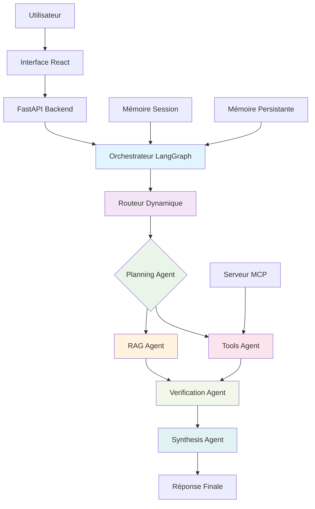
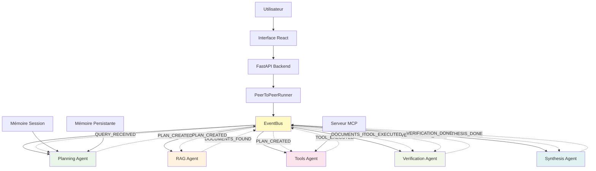

# AcademiMAS — Étude Comparative des Architectures Multi-Agents

> **Plateforme de recherche** pour l'étude comparative approfondie de deux architectures multi-agents : Hiérarchique (LangGraph) et Peer-to-Peer (EventBus). Construit avec **Claude (Anthropic)**, **ChromaDB**, **FastAPI** et une interface React moderne pour faciliter l'expérimentation et l'analyse.

---

## Table des matières

1. [Vue d'ensemble](#vue-densemble)
2. [Objectifs de recherche](#objectifs-de-recherche)
3. [Architecture Hiérarchique](#architecture-hiérarchique)
4. [Architecture Peer-to-Peer (P2P)](#architecture-peer-to-peer-p2p)
5. [Comparaison des Architectures](#comparaison-des-architectures)
6. [Les agents et leurs rôles](#les-agents-et-leurs-rôles)
7. [Communication entre agents](#communication-entre-agents)
8. [Mémoire : session et persistante](#mémoire--session-et-persistante)
9. [Serveur MCP](#serveur-mcp)
10. [Routeur dynamique](#routeur-dynamique)
11. [Scalabilité — ajouter / retirer un agent](#scalabilité--ajouter--retirer-un-agent)
12. [Installation et lancement](#installation-et-lancement)
13. [Structure du projet](#structure-du-projet)
14. [Métriques et évaluation](#métriques-et-évaluation)

---

## Vue d'ensemble

AcademiMAS est une **plateforme expérimentale** conçue dans le cadre d'une **étude de recherche comparative** entre deux paradigmes d'architectures multi-agents. Le système implémente et compare deux approches distinctes pour la coordination et la communication entre agents spécialisés dans un environnement académique simulé.

Le système propose **deux architectures complémentaires** permettant une analyse rigoureuse de leurs performances respectives :

- **Architecture Hiérarchique** : Coordination centralisée via un orchestrateur LangGraph
- **Architecture Peer-to-Peer** : Communication décentralisée via un bus d'événements

---

## Objectifs de recherche

Cette plateforme a été développée dans le contexte d'une **étude comparative approfondie** visant à produire un **article scientifique** analysant les avantages et limitations respectives des architectures hiérarchique et peer-to-peer dans les systèmes multi-agents.

### Questions de recherche principales

1. **Efficacité comparative** : Quelle architecture offre les meilleures performances en termes de temps de réponse, fiabilité et qualité des résultats ?

2. **Robustesse et résilience** : Comment chaque architecture réagit-elle face aux pannes partielles, à la charge variable et aux erreurs individuelles ?

3. **Évolutivité** : Quelles sont les capacités d'extension et de maintenance de chaque approche lors de l'ajout ou la suppression d'agents ?

4. **Traçabilité et débogage** : Quelle architecture facilite le plus l'analyse post-mortem et la compréhension des décisions prises ?

5. **Cas d'usage optimaux** : Dans quels scénarios chaque architecture présente des avantages significatifs ?

### Méthodologie expérimentale

- **Métriques quantitatives** : temps de latence, taux de succès, scores de confiance, utilisation des ressources
- **Analyse qualitative** : facilité de débogage, maintenabilité du code, complexité d'extension
- **Tests comparatifs** : batteries de tests standardisées exécutées sur les deux architectures
- **Études de cas** : scénarios variés (questions simples, complexes, multi-domaines)

### Contribution scientifique attendue

L'étude vise à fournir des **recommandations pratiques** pour les développeurs de systèmes multi-agents, basées sur une évaluation empirique rigoureuse des deux paradigmes architecturaux.

**Fonctionnalités expérimentales communes** :
- **Décomposition de tâches** : Mécanismes de planification et distribution du travail
- **Recherche documentaire** : Système RAG avec base vectorielle ChromaDB
- **Exécution d'outils** : Intégration d'outils externes via protocole MCP
- **Validation de qualité** : Métriques de cohérence et détection d'erreurs
- **Gestion de mémoire** : Session et persistance pour analyse comportementale
- **Interface d'expérimentation** : Outils de monitoring et visualisation pour la recherche

**Environnement de test académique** :
- Scénarios de questions complexes pour évaluer les architectures
- Métriques automatisées de performance et fiabilité
- Logs détaillés pour analyse comparative
- Configuration flexible pour expérimentations contrôlées

---

## Architecture Hiérarchique

### Vue d'ensemble
L'architecture hiérarchique utilise un **orchestrateur central** (LangGraph StateGraph) qui contrôle le flux d'exécution des agents via un état partagé. L'orchestrateur décide de l'ordre d'activation des agents et gère la coordination.

### Diagramme d'architecture



### Orchestration et Flux des Agents

**Orchestrateur Central** :
- Point de contrôle unique qui gère l'état partagé (`AcademicState`)
- Utilise LangGraph pour définir le graphe d'exécution conditionnel
- Décide quels agents activer via le Routeur Dynamique

**Flux d'Exécution** :
1. **Entrée** : Requête utilisateur → Orchestrateur
2. **Routage** : Routeur analyse la requête et sélectionne les agents
3. **Planning** : PlanningAgent décompose la tâche
4. **Exécution Parallèle** : RAG et Tools agents travaillent simultanément
5. **Vérification** : VerificationAgent valide la cohérence
6. **Synthèse** : SynthesisAgent agrège la réponse finale

### Échanges de Messages

Les agents communiquent via l'**état partagé LangGraph** (`AcademicState`) :

```
PlanningAgent → state["plan"] → RAG/Tools Agents (contexte)
RAGAgent      → state["retrieved_docs"] → Verification/Synthesis
ToolsAgent    → state["tool_results"] → Verification/Synthesis
Verification  → state["verification_report"] → Synthesis
```

### Rôles des Agents

- **PlanningAgent** : Analyse et planifie la décomposition des tâches
- **RAGAgent** : Recherche documentaire vectorielle
- **ToolsAgent** : Exécution d'outils externes (calculs, code)
- **VerificationAgent** : Validation de cohérence et qualité
- **SynthesisAgent** : Agrégation finale de la réponse

### Logique de Coordination

- **Contrôle Centralisé** : L'orchestrateur contrôle qui, quand et comment
- **Distribution des Tâches** : Routeur décide quels agents activer
- **Validation des Réponses** : VerificationAgent évalue avant synthèse
- **Utilisation de la Mémoire** : Contexte session enrichit les décisions
- **Appels d'Outils** : ToolsAgent exécute via MCP ou directement

### Workflow Complet des Décisions

```
Requête → Analyse Complexité → Sélection Agents → Exécution → Validation → Synthèse → Réponse
```

---

## Architecture Peer-to-Peer (P2P)

### Vue d'ensemble
L'architecture P2P élimine l'orchestrateur central et utilise un **bus d'événements** pour la communication décentralisée. Les agents s'abonnent à des événements et réagissent de manière autonome.

### Diagramme d'architecture



### Orchestration et Flux des Agents

**Bus d'Événements** :
- Infrastructure de communication décentralisée
- Agents publient et s'abonnent à des événements
- Pas de contrôleur central ; coordination émergente

**Flux d'Exécution** :
1. **Publication Initiale** : PeerToPeerRunner publie `QUERY_RECEIVED`
2. **Réaction en Chaîne** : Agents réagissent aux événements pertinents
3. **Exécution Parallèle** : Plusieurs agents peuvent travailler simultanément
4. **Propagation** : Résultats publiés comme nouveaux événements
5. **Terminaison** : Attente de l'événement `SYNTHESIS_DONE`

### Échanges de Messages

Communication via le **bus d'événements** (`EventBus`) :

```
QUERY_RECEIVED    → PlanningAgent
PLAN_CREATED      → RAGAgent, ToolsAgent
DOCUMENTS_FOUND   → VerificationAgent
TOOL_EXECUTED     → VerificationAgent
VERIFICATION_DONE → SynthesisAgent
SYNTHESIS_DONE    → PeerToPeerRunner (terminaison)
```

### Rôles des Agents

Identiques à l'architecture hiérarchique, mais chaque agent :
- S'abonne aux événements entrants
- Traite les données reçues
- Publie ses résultats comme événement

### Logique de Coordination

- **Contrôle Décentralisé** : Pas d'orchestrateur ; agents autonomes
- **Distribution des Tâches** : Agents décident eux-mêmes de leur participation
- **Validation des Réponses** : VerificationAgent réagit aux événements des autres
- **Utilisation de la Mémoire** : Chaque agent gère son propre contexte
- **Appels d'Outils** : ToolsAgent publie les résultats via événements

### Workflow Complet des Décisions

```
Requête → Événement Initial → Réactions en Chaîne → Propagation → Synthèse Finale
```

---

## Comparaison des Architectures

| Aspect | Hiérarchique | Peer-to-Peer |
|---|---|---|
| **Contrôle** | Centralisé (orchestrateur) | Décentralisé (bus événements) |
| **Communication** | État partagé LangGraph | Bus d'événements asynchrone |
| **Coordination** | Graphe d'exécution prédéfini | Coordination émergente |
| **Distribution des Tâches** | Routeur décide | Agents s'auto-sélectionnent |
| **Validation** | Agent dédié vérifie tout | Validation réactive aux événements |
| **Mémoire** | État partagé global | Gestion locale par agent |
| **Outils** | Exécution centralisée | Publication des résultats |
| **Traçabilité** | Flux linéaire loggé | Chaîne d'événements |
| **Scalabilité** | Ajout d'agents facile | Recâblage des abonnements |
| **Tolérance aux Pannes** | Point de défaillance unique | Résilient aux pannes individuelles |

### Avantages et Inconvénients

#### Architecture Hiérarchique
**Avantages** :
- Contrôle précis du flux d'exécution
- Traçabilité complète des décisions
- Coordination garantie (pas de conflits)
- Facilité d'ajout d'agents
- Reprise sur erreur simplifiée

**Inconvénients** :
- Point de défaillance unique (orchestrateur)
- Moins flexible pour les workflows dynamiques
- Couplage plus fort entre composants
- Scalabilité limitée par l'orchestrateur

#### Architecture Peer-to-Peer
**Avantages** :
- Haute résilience (pas de point de défaillance)
- Flexibilité pour workflows adaptatifs
- Scalabilité horizontale naturelle
- Découplage des composants
- Tolérance aux pannes individuelles

**Inconvénients** :
- Coordination plus complexe à déboguer
- Risque de conflits ou boucles infinies
- Traçabilité moins évidente
- Configuration des abonnements manuelle

### Cas d'Utilisation

#### Quand utiliser l'Architecture Hiérarchique
- Applications critiques nécessitant une traçabilité stricte
- Workflows prédéfinis et stables
- Équipes préférant le contrôle centralisé
- Besoin de garanties de cohérence fortes
- Environnements avec ressources limitées

#### Quand utiliser l'Architecture Peer-to-Peer
- Systèmes distribués à grande échelle
- Workflows hautement dynamiques
- Tolérance aux pannes critique
- Équipes favorisant l'autonomie des composants
- Environnements cloud élastiques

---

## Les agents et leurs rôles

### 1. PlanningAgent (`planning`)

**Rôle** : Point d'entrée systématique. Analyse la question et produit un plan d'action structuré.

**Ce qu'il fait** :
- Décompose la question en sous-tâches ordonnées
- Estime la complexité : `low` / `medium` / `high`
- Détermine si RAG et/ou outils sont nécessaires
- Influence le routeur via l'état partagé (hiérarchique) ou événements (P2P)

**Modèle** : `claude-3-5-haiku-20241022` (rapide, économique)

**Sortie** : `state["plan"]` ou événement `PLAN_CREATED` — texte structuré Markdown

**Exemple de sortie** :
```
Stratégie : Recherche + calcul combinés
Complexité : medium
Étapes :
  1. Rechercher la définition du théorème de Bayes
  2. Trouver un exemple concret dans les documents
  3. Calculer un exemple numérique
```

---

### 2. RAGAgent (`rag`)

**Rôle** : Retrieval-Augmented Generation — recherche dans la base documentaire académique.

**Ce qu'il fait** :
- Requête vectorielle dans ChromaDB (cosine similarity)
- Enrichit la requête avec le plan du PlanningAgent
- Retourne les passages les plus pertinents avec scores de similarité
- Fallback sur les connaissances générales si aucun document indexé

**Modèle** : `claude-3-5-haiku-20241022`

**Stockage** : ChromaDB persistant (`./data/chroma_db`)

**Sortie** : `state["retrieved_docs"]` ou événement `DOCUMENTS_FOUND` — passages + sources + scores

---

### 3. ToolsAgent (`tools`)

**Rôle** : Exécution d'outils externes — calcul, code, recherche web.

**Ce qu'il fait** :
- Décide automatiquement quels outils utiliser (via LLM)
- Exécute les outils de façon sécurisée (sandbox Python)
- Intègre les outils MCP enregistrés dynamiquement

**Outils disponibles** :

| Outil | Description | Exemple |
|---|---|---|
| `calculator` | Expressions mathématiques | `"math.sqrt(144)"` |
| `python_executor` | Code Python sandboxé | `"print(sum(range(10)))"` |
| `wikipedia_search` | Résumés Wikipedia FR/EN | `"mécanique quantique"` |

**Modèle** : `claude-3-5-haiku-20241022`

**Sortie** : `state["tool_results"]` ou événement `TOOL_EXECUTED`

---

### 4. VerificationAgent (`verification`)

**Rôle** : Gardien de la qualité. Lit toutes les sorties des agents précédents et évalue leur cohérence.

**Ce qu'il fait** :
- Détecte les incohérences entre RAG et outils
- Identifie les affirmations potentiellement halluccinées
- Produit un score de confiance [0, 1]
- Émet une recommandation : `PROCEED` / `RETRY` / `FALLBACK`

**Modèle** : `claude-3-5-haiku-20241022`

**Sortie** : `state["verification_report"]` ou événement `VERIFICATION_DONE` — JSON structuré :
```json
{
  "confidence_score": 0.87,
  "consistency_check": "Cohérent",
  "potential_hallucinations": [],
  "recommendation": "PROCEED",
  "quality_score": 0.85,
  "verification_notes": "Sources cohérentes, calcul vérifié."
}
```

---

### 5. SynthesisAgent (`synthesis`)

**Rôle** : Agrégateur final. Combine toutes les sorties en une réponse académique structurée.

**Ce qu'il fait** :
- Intègre plan + docs RAG + résultats outils + rapport de vérification
- Structure la réponse avec Markdown (titres, listes, code)
- Adapte le ton académique (précis, rigoureux, pédagogique)
- Signale les incertitudes si confidence < 60%
- Bascule en mode FALLBACK si la vérification le recommande

**Modèle** : `claude-3-5-sonnet-20241022` (plus puissant pour la synthèse)

**Sortie** : `state["final_answer"]` ou événement `SYNTHESIS_DONE` — réponse Markdown finale

---

## Communication entre agents

### Architecture Hiérarchique (A2A via État Partagé)

Les agents communiquent via l'**état partagé LangGraph** (`AcademicState`). C'est le cœur du protocole Agent-to-Agent (A2A).

#### Flux de données

```
PlanningAgent → state["plan"] → RAGAgent (enrichit sa requête)
                              → VerificationAgent (contexte)
                              → SynthesisAgent (structure)

RAGAgent      → state["retrieved_docs"] → VerificationAgent
                                        → SynthesisAgent

ToolsAgent    → state["tool_results"]   → VerificationAgent
                                        → SynthesisAgent

VerificationAgent → state["verification_report"] → SynthesisAgent
```

#### Avantages de l'état partagé

1. **Pas de couplage direct** : les agents ne se connaissent pas, ils lisent/écrivent l'état
2. **Traçabilité complète** : chaque modification est loggée avec l'agent responsable
3. **Reprise sur erreur** : si un agent échoue, l'état reste cohérent pour les suivants
4. **Thread-safe** : LangGraph gère la concurrence via `Annotated` + `operator.add`

### Architecture P2P (via Bus d'Événements)

Les agents communiquent via le **bus d'événements** (`EventBus`) de manière asynchrone.

#### Flux d'événements

```
QUERY_RECEIVED    → PlanningAgent
PLAN_CREATED      → RAGAgent, ToolsAgent
DOCUMENTS_FOUND   → VerificationAgent
TOOL_EXECUTED     → VerificationAgent
VERIFICATION_DONE → SynthesisAgent
SYNTHESIS_DONE    → PeerToPeerRunner (terminaison)
```

#### Avantages du bus d'événements

1. **Découplage complet** : agents indépendants, abonnements configurables
2. **Asynchrone** : traitement parallèle naturel
3. **Évolutif** : ajout d'agents sans modifier les existants
4. **Résilient** : pannes isolées n'arrêtent pas le système

---

## Mémoire : session et persistante

### Mémoire de session (`SessionMemory`)

- **Type** : In-memory Python dict
- **Durée de vie** : durée du processus serveur
- **Usage** : contexte des derniers tours de conversation
- **Capacité** : 20 derniers tours par session
- **Rôle dans l'architecture** :
  - **Hiérarchique** : enrichit la requête envoyée au routeur
  - **P2P** : chaque agent peut accéder au contexte session

### Mémoire persistante (`PersistentMemory`)

- **Type** : SQLite (`./data/memory.db`)
- **Durée de vie** : permanente (survit aux redémarrages)
- **Usage** : historique complet, statistiques, analytics
- **Schéma** :

```sql
CREATE TABLE conversations (
    id           INTEGER PRIMARY KEY,
    session_id   TEXT,
    run_id       TEXT,
    query        TEXT,
    answer       TEXT,
    agents_used  TEXT,   -- JSON array
    confidence   REAL,
    latency_ms   REAL,
    timestamp    TEXT,
    metadata     TEXT    -- JSON object
);
```

**Accès** : Via l'API REST ou directement dans le code backend

---

## Serveur MCP

Le module `backend/mcp/__init__.py` implémente un serveur **Model Context Protocol** léger.

**Outils MCP pré-enregistrés** :
- `latex_formatter` : formate une expression en LaTeX
- `citation_formatter` : génère une citation APA

**Manifest MCP** (endpoint `/api/tools/manifest`) :
```json
{
  "tools": [
    {"name": "latex_formatter", "description": "...", "inputSchema": {...}},
    {"name": "citation_formatter", "description": "...", "inputSchema": {...}}
  ],
  "version": "1.0",
  "protocol": "MCP/1.0"
}
```

---

## Routeur dynamique

Le routeur (`backend/utils/router.py`) sélectionne les agents à activer pour chaque requête.

### Signaux de routage

| Signal | Source | Impact |
|---|---|---|
| **Type de requête** | Patterns regex sur la question | Active RAG, Tools, ou les deux |
| **Charge contextuelle** | Nombre de messages + longueur query | Évite la surcharge |
| **Agents disponibles** | Registry en temps réel | Routing adaptatif |
| **Complexité** | Nombre d'agents sélectionnés | Estimation coût |

### Logique de décision

```
Question → contient mots de recherche ? → active RAG
         → contient calcul/code ?        → active Tools
         → plusieurs agents actifs ?     → active Verification
         → toujours                      → Planning + Synthesis
```

### RouterDecision

```python
{
    "selected_agents": ["planning", "rag", "tools", "verification", "synthesis"],
    "reasoning": "recherche documentaire | calcul détecté | vérification multi-sources",
    "estimated_complexity": "high",
    "context_load": 0.12
}
```

---

## Scalabilité — ajouter / retirer un agent

### ✅ Ajouter un agent (3 étapes)

**Étape 1** : Créer le fichier agent

Créer un nouveau fichier dans `backend/agents/` qui hérite de `BaseAgent`.

**Étape 2** : Enregistrer dans le registry

Ajouter l'agent au registre lors de l'initialisation du système.

**Étape 3** : (Optionnel) Ajouter des patterns au routeur

Configurer le routeur pour activer l'agent selon certains critères.

**C'est tout.** Aucun autre fichier à modifier.

---

### ❌ Retirer un agent (1 étape)

Retirer l'agent du registre. Le système s'adapte automatiquement.

---

### Pourquoi c'est scalable ?

1. **Registry singleton** : source de vérité unique pour tous les agents
2. **BaseAgent** : contrat commun — chaque agent est interchangeable
3. **État typé** : `AcademicState` découple les agents (pas d'appels directs)
4. **`rebuild_graph()`** : hot-reload sans redémarrer le serveur
5. **Routeur dynamique** : s'adapte automatiquement aux agents disponibles

---

## Installation et lancement

### Prérequis

- Python 3.10+
- Node.js 18+
- Clé API Anthropic

### Backend

```bash
# 1. Cloner et configurer
cd academic-mas
cp .env.example .env
# Éditer .env : ajouter ANTHROPIC_API_KEY=sk-ant-...

# 2. Installer les dépendances Python
pip install -r requirements.txt

# 3. Lancer le serveur FastAPI
python -m uvicorn backend.main:app --reload --port 8000
```

Le serveur sera disponible sur `http://localhost:8000`.
Documentation API interactive : `http://localhost:8000/docs`

### Frontend

```bash
# Dans un second terminal
cd frontend
npm install
npm run dev
```

L'interface sera disponible sur `http://localhost:3000`.

### Ajouter des documents à la base RAG

Utiliser l'endpoint REST `/api/documents` pour ajouter du contenu à la base documentaire.

---

## Structure du projet

```
academic-mas/
│
├── backend/
│   ├── main.py                      # Serveur FastAPI
│   ├── orchestrator.py              # LangGraph StateGraph
│   ├── state.py                     # AcademicState (état partagé)
│   │
│   ├── agents/
│   │   ├── base.py                  # BaseAgent (classe abstraite)
│   │   ├── registry.py              # AgentRegistry (scalabilité)
│   │   ├── planning_agent.py        # Agent 1 : Planification
│   │   ├── rag_agent.py             # Agent 2 : Retrieval / RAG
│   │   ├── tools_agent.py           # Agent 3 : Outils / MCP
│   │   ├── verification_agent.py    # Agent 4 : Vérification
│   │   ├── synthesis_agent.py       # Agent 5 : Synthèse finale
│   │   └── example_custom_agent.py  # Template pour nouveaux agents
│   │
│   ├── memory/
│   │   └── memory_manager.py        # Session + persistante (SQLite)
│   │
│   ├── mcp/
│   │   └── __init__.py              # Serveur MCP local
│   │
│   └── utils/
│       └── router.py                # Routeur dynamique
│
├── frontend/
│   ├── index.html
│   ├── vite.config.js
│   ├── package.json
│   └── src/
│       ├── main.jsx                 # Point d'entrée React
│       └── App.jsx                  # Interface complète
│
├── data/                            # Créé automatiquement
│   ├── chroma_db/                   # Base vectorielle RAG
│   └── memory.db                    # Historique SQLite
│
├── requirements.txt
├── .env.example
└── README.md
```

---

## Métriques et évaluation

### Framework d'évaluation comparative

Le système collecte automatiquement des **métriques quantitatives et qualitatives** pour permettre une analyse rigoureuse des deux architectures. Ces métriques sont essentielles pour l'étude comparative et la production de l'article scientifique.

### Métriques quantitatives collectées

| Métrique | Description | Unité | Portée |
|---|---|---|---|
| `latency_ms` | Temps de réponse total par architecture | millisecondes | Par requête |
| `agent_latency_ms` | Temps d'exécution par agent individuel | millisecondes | Par agent/par requête |
| `confidence_score` | Score de confiance global [0, 1] | décimal | Par réponse |
| `quality_score` | Score de qualité subjectif [0, 1] | décimal | Par réponse |
| `consistency_score` | Degré de cohérence interne | décimal | Par réponse |
| `success_rate` | Taux de succès des exécutions | pourcentage | Par architecture |
| `error_rate` | Taux d'échec et exceptions | pourcentage | Par architecture |

### Métriques qualitatives et comportementales

| Aspect | Hiérarchique | Peer-to-Peer |
|---|---|---|
| **Traçabilité** | Flux linéaire complet | Chaîne d'événements distribuée |
| **Débogage** | Logs séquentiels faciles | Analyse d'événements complexe |
| **Maintenance** | Ajout d'agents simple | Recâblage des abonnements |
| **Résilience** | Point de défaillance unique | Tolérance aux pannes élevée |
| **Évolutivité** | Limitée par orchestrateur | Horizontale naturelle |

### Protocole d'expérimentation

#### Configuration des tests
- **Jeu de données** : 100+ questions académiques calibrées (mathématiques, physique, informatique)
- **Niveaux de complexité** : Simple (1 agent), Moyen (2-3 agents), Complexe (4+ agents)
- **Charge variable** : Tests de stress avec requêtes simultanées
- **Scénarios de panne** : Simulation de défaillances partielles

#### Collecte automatique des métriques
```json
{
  "experiment_id": "exp_2024_001",
  "architecture": "hierarchical|p2p",
  "query_complexity": "low|medium|high",
  "metrics": {
    "total_latency_ms": 2450,
    "agent_latencies": {
      "planning": 320,
      "rag": 890,
      "tools": 650,
      "verification": 290,
      "synthesis": 300
    },
    "quality_scores": {
      "confidence": 0.87,
      "consistency": 0.92,
      "accuracy": 0.89
    },
    "execution_status": "success|partial_failure|complete_failure"
  },
  "logs": {
    "events_sequence": [...],
    "error_messages": [...],
    "agent_interactions": [...]
  }
}
```

#### Analyses statistiques
- **Tests de Student** : Comparaison des moyennes de latence
- **Tests du χ²** : Analyse des taux de succès
- **Corrélation** : Impact de la complexité sur les performances
- **Analyse de variance** : Effets des architectures sur différentes métriques

### API d'analyse et reporting

```
GET /api/experiments/{experiment_id}/metrics
→ Données brutes pour analyse statistique

GET /api/comparison/{metric_name}
→ Comparaison directe entre architectures

POST /api/experiments
→ Lancement d'une nouvelle campagne de tests
```

### Résultats attendus pour l'article scientifique

L'étude vise à répondre aux questions suivantes :

1. **Performance absolue** : Quelle architecture offre les meilleures performances globales ?
2. **Performance relative** : Comment les architectures se comportent-elles selon la complexité des tâches ?
3. **Robustesse** : Quelle architecture résiste mieux aux pannes et à la charge variable ?
4. **Maintenabilité** : Quel paradigme facilite le plus l'évolution et la maintenance du système ?
5. **Recommandations** : Dans quels contextes privilégier chaque architecture ?

Ces analyses fourniront des **insights pratiques** pour guider les architectes de systèmes multi-agents dans leurs choix technologiques.

---

## Licence et utilisation académique

**MIT License** — Ce projet est développé dans un contexte de recherche académique. L'utilisation est libre avec attribution pour fins éducatives et de recherche.

### Citation recommandée

Pour toute utilisation dans des publications ou travaux dérivés :

```bibtex
@software{academicmas2024,
  title={AcademiMAS: Comparative Study of Hierarchical and Peer-to-Peer Multi-Agent Architectures},
  author={Votre Nom},
  year={2024},
  url={https://github.com/votre-repo/academic-mas},
  note={Plateforme expérimentale pour étude comparative des architectures multi-agents}
}
```

### Contact et contributions

Ce projet fait partie d'une **étude de recherche** sur les architectures multi-agents. Pour toute question relative à la recherche ou collaboration :

- **Issues GitHub** : Signalement de bugs ou suggestions d'amélioration
- **Discussions** : Questions sur l'architecture ou les métriques
- **Email** : Contact direct pour collaborations de recherche

---

*Développé dans le cadre d'une étude comparative approfondie visant à produire un article scientifique sur les paradigmes architecturaux des systèmes multi-agents.*