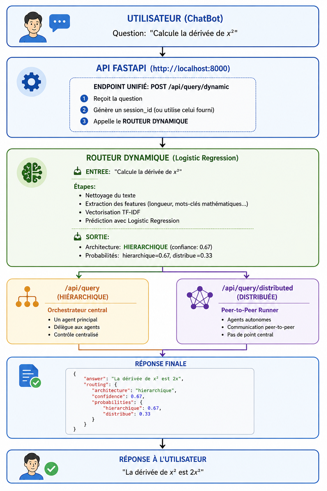

# 5. Architectures comparées

## 5.1 Architecture hiérarchique (chef d'orchestre)

### Principe

L'architecture hiérarchique repose sur un **orchestrateur central LangGraph** (`StateGraph`) qui contrôle l'intégralité du flux d'exécution des agents. Chaque décision — quel agent appeler, dans quel ordre, selon quelle condition — est prise et enregistrée par cet orchestrateur unique. Il constitue le seul point de décision du système.


## **Vision globale du système**

La figure ci-dessous illustre la vision globale du flux du système multi-agents proposé. Elle met en évidence le rôle du Meta-Router, la sélection dynamique de l’architecture, ainsi que l’enchaînement des agents spécialisés au sein des deux paradigmes (hiérarchique et distribué).


### Flux d'exécution

```
Requête → PlanningAgent → [RAGAgent] → [ToolsAgent] → [VerificationAgent] → SynthesisAgent → Réponse
```

> Les crochets `[ ]` indiquent les agents activés **conditionnellement** par le routeur dynamique interne, selon les patterns regex et heuristiques analysant le plan produit par le `PlanningAgent`.

**Fichier principal :** `backend/orchestrator.py`

### Communication entre agents

Les agents communiquent via l'état partagé `AcademicState` (TypedDict LangGraph). Chaque agent lit les données dont il a besoin et écrit ses résultats dans cet état commun :

```
PlanningAgent     → state["plan"]                  → RAGAgent, VerificationAgent, SynthesisAgent
RAGAgent          → state["retrieved_docs"]         → VerificationAgent, SynthesisAgent
ToolsAgent        → state["tool_results"]           → VerificationAgent, SynthesisAgent
VerificationAgent → state["verification_report"]   → SynthesisAgent
SynthesisAgent    → state["final_answer"]           → Réponse finale
```

Structure complète de l'état partagé :

```python
class AcademicState(TypedDict):
    messages: Annotated[List[BaseMessage], add_messages]
    user_query: str
    session_id: str
    router_decision: RouterDecision
    plan: str
    retrieved_docs: str
    tool_results: str
    verification_report: Dict
    final_answer: str
    agent_results: List[AgentResult]
    errors: List[str]
```

### Caractéristiques techniques

| Propriété | Valeur |
| :--- | :--- |
| Coordinateur | Orchestrateur LangGraph centralisé |
| Communication | État partagé `AcademicState` (TypedDict) |
| Ordre d'exécution | Séquentiel, déterministe |
| Décision de routage | Routeur interne — patterns regex + heuristiques |
| Reprise sur erreur | Point de contrôle unique (orchestrateur) |
| Fichier principal | `backend/orchestrator.py` |

### Lancer une requête en mode hiérarchique

```bash
curl -X POST http://localhost:8000/api/query \
  -H "Content-Type: application/json" \
  -d '{"query": "Explique le théorème de Bayes avec un exemple.", "architecture": "hierarchical"}'
```

---

## 5.2 Architecture distribuée / peer-to-peer

### Principe

L'architecture distribuée supprime l'orchestrateur central. Les agents sont **autonomes** : ils réagissent aux événements publiés sur un `EventBus` singleton thread-safe. Chaque agent s'abonne aux événements qui le concernent (`trigger_events`) et publie son résultat comme un nouvel événement (`output_event`). Aucun composant central ne décide du flux — c'est la **topologie des abonnements** qui structure implicitement le pipeline.

**Fichier principal :** `backend/distributed/p2p_runner.py`

### Graphe d'événements

| Événement | Émis par | Déclenche |
| :--- | :--- | :--- |
| `QUERY_RECEIVED` | `PeerToPeerRunner` | Agent de planification |
| `PLAN_CREATED` | Agent de planification | RAGAgent, ToolsAgent |
| `DOCUMENTS_FOUND` | RAGAgent | ToolsAgent, VerificationAgent |
| `TOOL_EXECUTED` | ToolsAgent | VerificationAgent |
| `VERIFICATION_DONE` | VerificationAgent | SynthesisAgent |
| `SYNTHESIS_DONE` | SynthesisAgent | *(fin du pipeline — débloque le runner)* |
| `ERROR` | N'importe quel agent | *(débloque le wait et remonte l'erreur)* |

### Composants clés

#### EventBus (`backend/distributed/event_bus.py`)

Bus d'événements thread-safe implémenté comme singleton. Il maintient :
- Un registre d'abonnés par type d'événement
- Un état agrégé par session (accumulation des sorties de chaque agent)
- Des `threading.Event` pour que le runner puisse attendre sans polling actif

```python
# Publier un événement
bus.publish(Event(
    type=EventType.PLAN_CREATED,
    payload={"plan": "...", "user_query": "..."},
    source="PlanningAgent",
    session_id="session-xyz",
))

# S'abonner à un type d'événement
bus.subscribe(EventType.PLAN_CREATED, my_callback)

# Lire l'état agrégé d'une session
state = bus.get_state("session-xyz")
```

#### DistributedAgentWrapper (`backend/distributed/distributed_agents.py`)

Chaque agent existant est encapsulé dans un wrapper générique qui :
1. S'abonne aux événements déclencheurs (`trigger_events`)
2. Reconstruit un `AcademicState` complet depuis l'état agrégé du bus
3. Appelle `agent.process(state)` **sans modification de la logique métier**
4. Publie le résultat comme nouvel événement (`output_event`)

```python
class DistributedRAGAgent(DistributedAgentWrapper):
    trigger_events = [EventType.PLAN_CREATED]
    output_event   = EventType.DOCUMENTS_FOUND

    def _extract_payload(self, result, state):
        return {"retrieved_docs": result.get("retrieved_docs", "")}
```

> Un mécanisme de limitation est intégré (délai minimum entre deux appels LLM pour la même session) afin de respecter les limites de débit de l'API Anthropic.

#### PeerToPeerRunner (`backend/distributed/p2p_runner.py`)

Point d'entrée du pipeline P2P. Il :
1. Instancie les agents une seule fois
2. Les enregistre sur le bus
3. Publie `QUERY_RECEIVED`
4. Attend `SYNTHESIS_DONE` avec un timeout de **180 secondes**

Le format de retour est identique à celui de l'architecture hiérarchique pour faciliter la comparaison.

### Caractéristiques techniques

| Propriété | Valeur |
| :--- | :--- |
| Coordinateur | Aucun — agents réactifs aux événements |
| Communication | Publication/abonnement `EventBus` |
| Ordre d'exécution | Réactif, parallèle possible selon la topologie |
| Décision de routage | Implicite (topologie des abonnements) |
| Reprise sur erreur | Publication d'un événement `ERROR` |
| Fichier principal | `backend/distributed/p2p_runner.py` |

### Lancer une requête en mode distribué

```bash
curl -X POST http://localhost:8000/api/query \
  -H "Content-Type: application/json" \
  -d '{"query": "Explique le théorème de Bayes avec un exemple.", "architecture": "p2p"}'
```

---

## 5.3 Comparaison des deux approches

| Critère | Hiérarchique | Distribuée (P2P) |
| :--- | :--- | :--- |
| Coordinateur | Orchestrateur LangGraph centralisé | Aucun — EventBus |
| Communication | État partagé `AcademicState` | Publication/abonnement |
| Ordre d'exécution | Séquentiel, déterministe | Réactif, parallèle possible |
| Décision de routage | Routeur interne (regex + heuristiques) | Topologie des abonnements |
| Traçabilité | Maximale — chaque décision loggée | Distribuée par événement |
| Complexité d'implémentation | Faible | Élevée |
| Reprise sur erreur | Point de contrôle unique | Événement `ERROR` diffusé |
| Extensibilité | Enregistrement registre + rebuild graph | Abonnement à un événement |
| Fichier principal | `backend/orchestrator.py` | `backend/distributed/p2p_runner.py` |

### Résultats expérimentaux

Ces métriques sont issues du protocole d'évaluation formalisé de l'article scientifique associé : **107 questions académiques annotées**, 320 exécutions au total (160 par architecture), réparties en 5 catégories (analytique, mathématique, code, comparative, générale).

| Métrique | Hiérarchique | Distribuée (P2P) |
| :--- | :---: | :---: |
| Score de qualité moyen | ~8,9 / 10 | ~8,9 / 10 |
| Confiance moyenne | 0,84 | 0,87 |
| Latence moyenne | ~3 200 ms | ~2 700 ms |
| Taux d'hallucination (analytique / math) | **Quasi nul** | Plus élevé |
| Performance sur tâches de code | Moins adaptée | **Mieux adaptée** |
| Stabilité sur tâches comparatives | **Stable** | Instabilité marquée |

> Ces résultats confirment qu'**aucune architecture n'est universellement préférable** : le choix optimal dépend du type de tâche, ce qui justifie l'approche de routage dynamique par le Meta-Router (section 6).

### Mode comparaison (les deux en parallèle)

Il est possible d'exécuter les deux architectures simultanément sur la même requête pour comparer leurs résultats :

```bash
curl -X POST http://localhost:8000/api/query \
  -H "Content-Type: application/json" \
  -d '{"query": "Explique le théorème de Bayes avec un exemple.", "architecture": "compare"}'
```

Les métriques (latence, qualité, hallucination, score global, architecture utilisée) sont enregistrées dans la base SQLite (`./data/memory.db`) pour analyse ultérieure :

```sql
CREATE TABLE conversations (
    id           INTEGER PRIMARY KEY,
    session_id   TEXT,
    run_id       TEXT,
    query        TEXT,
    answer       TEXT,
    agents_used  TEXT,
    confidence   REAL,
    latency_ms   REAL,
    architecture TEXT,   -- "hierarchical" | "p2p"
    timestamp    TEXT,
    metadata     TEXT
);
```

Consultation des statistiques comparatives via l'API :

```bash
GET /api/stats
```

```json
{
  "total_conversations": 42,
  "by_architecture": {
    "hierarchical": { "count": 21, "avg_confidence": 0.84, "avg_latency_ms": 3200 },
    "p2p":          { "count": 21, "avg_confidence": 0.87, "avg_latency_ms": 2700 }
  },
  "meta_router_accuracy": 0.76
}
```

---

## 5.4 Avantages et limites

### Architecture hiérarchique 

**Avantages :**
- **Traçabilité maximale** : chaque décision est loggée avec son agent source et son contexte
- **Cohérence garantie** par le contrôle centralisé de l'orchestrateur
- **Détection et reprise sur erreur simplifiées** : un seul point de contrôle
- **Robustesse supérieure** sur les tâches analytiques et mathématiques (taux d'hallucination quasi nul)
- **Coût réduit** grâce au routage sélectif des agents (activation conditionnelle)
- **Débogage facilité** : le flux est linéaire et prévisible

**Limites :**
- Exécution strictement **séquentielle** — pas de parallélisme natif
- **Point de défaillance unique** : si l'orchestrateur échoue, tout le pipeline s'arrête
- **Rigidité architecturale** : l'ajout d'un agent nécessite un rebuild du graphe (`orchestrator.rebuild_graph()`)
- Moins adapté aux tâches de génération de code

### Architecture distribuée (peer-to-peer) 

**Avantages :**
- **Découplage total** entre agents — chaque agent est indépendant
- **Parallélisme naturel** : RAGAgent et ToolsAgent peuvent se déclencher simultanément après `PLAN_CREATED`
- **Extensibilité maximale** : ajouter un agent = s'abonner à un événement existant, sans toucher au reste
- **Résilience** : un agent défaillant publie `ERROR` mais n'arrête pas les autres agents déjà en cours
- **Meilleure adaptation** aux tâches de code
- **Latence globale légèrement inférieure** (~2 700 ms vs ~3 200 ms en moyenne)

**Limites :**
- **Risque élevé de dépassement de *rate limit*** API Anthropic lorsque plusieurs agents se déclenchent en parallèle (mécanisme de throttling intégré dans `DistributedAgentWrapper` pour mitiger ce risque)
- **Overhead de coordination** par l'EventBus (gestion des abonnements, reconstruction de l'état, threading)
- **Traçabilité distribuée** : le debug est plus complexe — les événements sont éparpillés entre plusieurs composants
- **Instabilité plus marquée** sur les tâches analytiques et comparatives
- **Implémentation plus complexe** : chaque agent existant doit être encapsulé dans un `DistributedAgentWrapper`

---

> **À retenir** : le constat expérimental est clair — les deux architectures se valent globalement (~8,9/10 en qualité), mais leurs forces divergent selon le type de tâche. L'architecture hiérarchique excelle sur les tâches analytiques et mathématiques ; l'architecture distribuée est plus efficace sur les tâches de code. C'est précisément ce constat qui motive et valide la pertinence du **Meta-Router** décrit en section 6 : un classifieur supervisé (Régression Logistique, accuracy 81,5%, F1-macro 0,75) entraîné à sélectionner dynamiquement l'architecture optimale selon la nature de la requête.


### Références principales

- [AutoGen – Microsoft](https://github.com/microsoft/autogen)  
Framework multi-agents basé sur la communication entre agents LLM pour la résolution collaborative de tâches.

- [LangGraph](https://github.com/langchain-ai/langgraph)  
Framework basé sur les graphes d’états permettant d’orchestrer des systèmes agentiques complexes.

- [LangChain](https://github.com/langchain-ai/langchain)  
Bibliothèque pour construire des applications basées sur des modèles de langage et des chaînes de traitement.

- [ChromaDB](https://www.trychroma.com/)  
Base de données vectorielle utilisée dans les systèmes de Retrieval-Augmented Generation (RAG).

- [Retrieval-Augmented Generation (RAG)](https://arxiv.org/abs/2005.11401)  
Approche combinant récupération d’information et génération pour améliorer la factualité des LLM.

- [Mixture of Experts (MoE)](https://arxiv.org/abs/1701.06538)  
Architecture introduisant un mécanisme de routage dynamique vers des experts spécialisés.

- [ReAct: Reasoning and Acting](https://arxiv.org/abs/2210.03629)  
Paradigme combinant raisonnement et utilisation d’outils externes dans les LLM.

---

### Positionnement de notre approche

Contrairement à ces travaux, notre méthode propose :

- un routage **supervisé et explicable**
- une sélection entre **architecture hiérarchique vs distribuée**
- une approche **légère basée sur TF-IDF + features linguistiques**
- un modèle entraîné sur **un dataset réel annoté**
- une alternative aux routeurs LLM coûteux et non interprétables


## **Ressources du projet**

Afin de faciliter la compréhension, la reproductibilité et la poursuite de la lecture de ce projet de recherche, l’ensemble des ressources utilisées est mis à disposition ci-dessous.

### **Questions d’étude (160 questions brutes par architecture)**

[Accéder aux questions d’étude](https://drive.google.com/file/d/1KxcRF8VK9NqW_yjPUW-WgKlcsN5eL6b4/view)

---

### **Dataset – Architecture hiérarchique (résultats annotés)**

[Accéder au dataset hiérarchique](https://drive.google.com/file/d/1dcOwou6JVUA68kl5kPCj0jiz2jEOUPop/view)

---

### **Dataset – Architecture distribuée (résultats annotés)**

[Accéder au dataset distribué](https://drive.google.com/file/d/1HHVlSkyogRWjRE2g1GrIuNCG4xcSZ1sb/view)

---

### **Notebook d’expérimentation**

(Prétraitement, entraînement, évaluation et étude d’ablation)

[Ouvrir le notebook d’expérimentation](https://drive.google.com/file/d/1FDWvlUyVW47MFLkkxf3gtsI1Q7Rd7Zs3/view)

---

### **Meilleur modèle retenu (pipeline sérialisé – Joblib)**

[Télécharger le modèle joblib](https://drive.google.com/file/d/1WbaPRPV0YPI0Ex_daTexzFJF0g5arV27/view)

---

## **Dépôt GitHub officiel**

Le code source complet du projet est disponible sur le dépôt GitHub officiel suivant :

[Accéder au dépôt GitHub](https://github.com/hinimdoumorsia/MultiAgentStudyArchitecture)