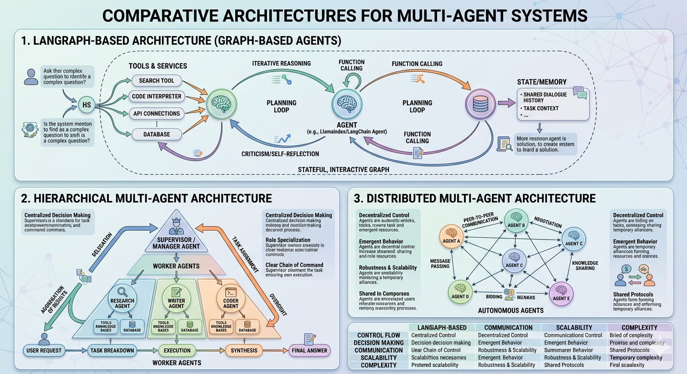
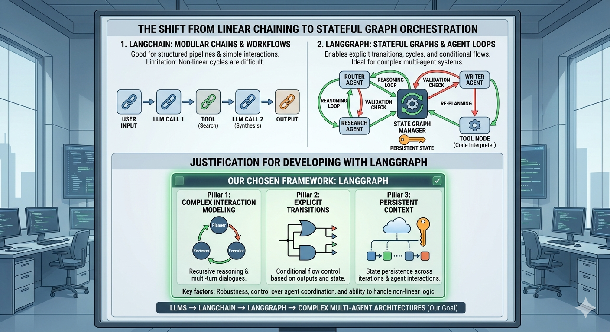
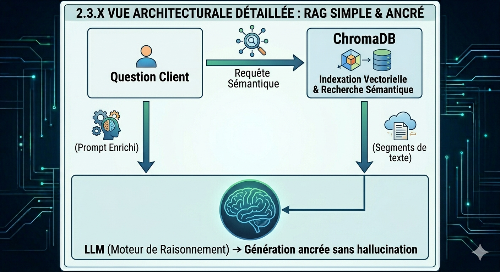
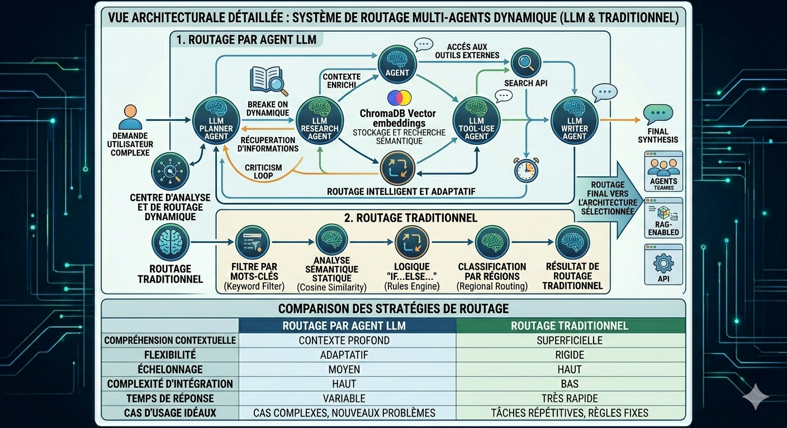

# 2. État de l’art

## 2.1 Architectures multi-agents (hiérarchique, distribuée, graphe)

Les systèmes multi-agents (SMA) constituent un paradigme central des systèmes distribués modernes, permettant la coordination de plusieurs entités intelligentes pour résoudre des tâches complexes. Historiquement, deux grandes familles d’architectures sont distinguées : les architectures hiérarchiques et les architectures distribuées.

Dans les architectures hiérarchiques, un agent orchestrateur central est responsable de la décomposition des tâches, de leur assignation aux agents spécialisés et de l’agrégation des résultats. Ce modèle est largement utilisé dans les systèmes modernes basés sur LLM, notamment pour sa simplicité de contrôle et sa capacité à structurer les processus de raisonnement.

À l’inverse, les architectures distribuées (peer-to-peer ou event-driven) reposent sur une coordination sans point central de contrôle. Les agents communiquent via des mécanismes tels que des EventBus, permettant une meilleure robustesse et une scalabilité accrue, au prix d’une coordination plus difficile à stabiliser.

Plus récemment, les architectures en graphe (graph-based orchestration) ont émergé comme compromis, où les flux d’exécution sont modélisés sous forme de graphes d’état, permettant un contrôle plus flexible des cycles de raisonnement et des interactions multi-agents.

Ces paradigmes structurent aujourd’hui la majorité des frameworks modernes de SMA, et leur comparaison constitue un axe de recherche actif.

### Illustration de l’architecture globale du système

*Figure 1 — Vue globale de l’architecture proposée illustrant la coexistence des modes hiérarchique et distribué avec mécanisme de routage intelligent.*

## 2.2 Orchestration des LLM
L’émergence des grands modèles de langage (LLMs) a profondément transformé la conception des systèmes multi-agents. Des frameworks tels que LangChain et LangGraph ont permis de structurer l’orchestration des LLM autour de pipelines modulaires et d’états persistants.

LangChain fournit une abstraction permettant de chaîner des appels à des modèles, des outils externes et des mémoires, facilitant la construction de workflows complexes. Cependant, ses limites apparaissent dans les systèmes fortement dynamiques où les cycles d’exécution ne sont pas linéaires.

Pour répondre à cette limitation, LangGraph introduit une approche basée sur des graphes d’état (state graphs), permettant de modéliser explicitement les transitions entre agents et les boucles de raisonnement. Cette approche est particulièrement adaptée aux systèmes multi-agents nécessitant des interactions cycliques, des validations et des retours conditionnels.

Ces outils constituent aujourd’hui la base de nombreuses architectures LLM multi-agents modernes, en particulier dans les systèmes de raisonnement complexe et de planification.

### Choix de l’architecture d’orchestration

*Figure 2 — Justification du choix de LangGraph face aux alternatives telles que LangChain et AutoGen pour la gestion des workflows multi-agents.*

## 2.3 RAG et systèmes augmentés

Les modèles de langage présentent des limites connues en termes de connaissance statique, de fraîcheur de l’information et de fiabilité factuelle. Pour pallier ces limites, les approches Retrieval-Augmented Generation (RAG) ont été introduites.

Le principe du RAG consiste à enrichir le contexte du modèle avec des informations récupérées dynamiquement depuis des bases externes (documents, bases vectorielles, API). Cela permet d’améliorer la précision des réponses et de réduire les hallucinations.

Des systèmes comme ChromaDB sont largement utilisés pour implémenter ces approches via des embeddings vectoriels permettant une recherche sémantique efficace. Dans un contexte multi-agent, le RAG devient un composant critique, chaque agent pouvant interagir avec une mémoire externe pour enrichir ses décisions.

Ainsi, les architectures modernes combinent souvent LLM + RAG + outils externes pour former des systèmes augmentés capables de raisonnement grounded sur des données réelles.

### Architecture RAG du système

*Figure 3 — Schéma du module RAG utilisé dans notre système multi-agents basé sur une base vectorielle et un mécanisme de récupération contextuelle.*

## 2.4 Routage intelligent dans les systèmes IA

Le routage intelligent désigne les mécanismes permettant de sélectionner dynamiquement un composant, un modèle ou une architecture en fonction de l’entrée utilisateur.

Les approches classiques incluent les Mixture-of-Experts (MoE), où un réseau de routage apprend à activer dynamiquement un sous-ensemble d’experts pour chaque entrée. Cette approche a démontré son efficacité dans les modèles à grande échelle, mais elle reste coûteuse et difficile à interpréter.

Dans le domaine des LLM, plusieurs travaux récents explorent l’idée d’utiliser un LLM lui-même comme routeur, capable de décomposer une requête et d’assigner des sous-tâches à différents agents. Cependant, ces approches souffrent de coûts d’inférence élevés et d’un manque d’explicabilité.

Dans ce contexte, des approches plus légères et supervisées émergent, basées sur des classifieurs traditionnels ou des modèles de machine learning. Ces méthodes permettent un routage rapide, interprétable et contrôlable.

Notre travail s’inscrit dans cette dernière catégorie, en considérant explicitement le choix entre architectures multi-agents (hiérarchique vs distribuée) comme un problème de classification supervisée.

### Mécanisme de routage proposé

*Figure 4 — Schéma du mécanisme de routage intelligent sélectionnant dynamiquement l’architecture multi-agents adaptée à la requête utilisateur.*

## 2.5 Travaux existants et méthodes de référence

Les approches de routage dynamique et de coordination multi-agents s’inscrivent dans un ensemble de travaux récents issus des systèmes à base de LLM, des architectures agentiques et de l’apprentissage automatique supervisé. Ces travaux constituent les fondations des systèmes modernes d’orchestration intelligente.

Les frameworks actuels se concentrent principalement sur l’orchestration d’agents, la gestion de workflows complexes et l’amélioration des capacités des modèles via des mécanismes de récupération d’information (RAG). Cependant, le problème du **choix dynamique de l’architecture globale** reste encore peu exploré.

### Références principales

- [AutoGen – Microsoft](https://github.com/microsoft/autogen)  
Framework multi-agents basé sur la communication entre agents LLM pour la résolution collaborative de tâches.

- [LangGraph](https://github.com/langchain-ai/langgraph)  
Framework basé sur les graphes d’états permettant d’orchestrer des systèmes agentiques complexes.

- [LangChain](https://github.com/langchain-ai/langchain)  
Bibliothèque pour construire des applications basées sur des modèles de langage et des chaînes de traitement.

- [ChromaDB](https://www.trychroma.com/)  
Base de données vectorielle utilisée dans les systèmes de Retrieval-Augmented Generation (RAG).

- [Retrieval-Augmented Generation (RAG)](https://arxiv.org/abs/2005.11401)  
Approche combinant récupération d’information et génération pour améliorer la factualité des LLM.

- [Mixture of Experts (MoE)](https://arxiv.org/abs/1701.06538)  
Architecture introduisant un mécanisme de routage dynamique vers des experts spécialisés.

- [ReAct: Reasoning and Acting](https://arxiv.org/abs/2210.03629)  
Paradigme combinant raisonnement et utilisation d’outils externes dans les LLM.

---

### Positionnement de notre approche

Contrairement à ces travaux, notre méthode propose :

- un routage **supervisé et explicable**
- une sélection entre **architecture hiérarchique vs distribuée**
- une approche **légère basée sur TF-IDF + features linguistiques**
- un modèle entraîné sur **un dataset réel annoté**
- une alternative aux routeurs LLM coûteux et non interprétables

## **Ressources du projet**

Afin de faciliter la compréhension, la reproductibilité et la poursuite de la lecture de ce projet de recherche, l’ensemble des ressources utilisées est mis à disposition ci-dessous.

### **Questions d’étude (160 questions brutes par architecture)**

[Accéder aux questions d’étude](https://drive.google.com/file/d/1KxcRF8VK9NqW_yjPUW-WgKlcsN5eL6b4/view)

---

### **Dataset – Architecture hiérarchique (résultats annotés)**

[Accéder au dataset hiérarchique](https://drive.google.com/file/d/1dcOwou6JVUA68kl5kPCj0jiz2jEOUPop/view)

---

### **Dataset – Architecture distribuée (résultats annotés)**

[Accéder au dataset distribué](https://drive.google.com/file/d/1HHVlSkyogRWjRE2g1GrIuNCG4xcSZ1sb/view)

---

### **Notebook d’expérimentation**

(Prétraitement, entraînement, évaluation et étude d’ablation)

[Ouvrir le notebook d’expérimentation](https://drive.google.com/file/d/1FDWvlUyVW47MFLkkxf3gtsI1Q7Rd7Zs3/view)

---

### **Meilleur modèle retenu (pipeline sérialisé – Joblib)**

[Télécharger le modèle joblib](https://drive.google.com/file/d/1WbaPRPV0YPI0Ex_daTexzFJF0g5arV27/view)

---

## **Dépôt GitHub officiel**

Le code source complet du projet est disponible sur le dépôt GitHub officiel suivant :

[Accéder au dépôt GitHub](https://github.com/hinimdoumorsia/MultiAgentStudyArchitecture)