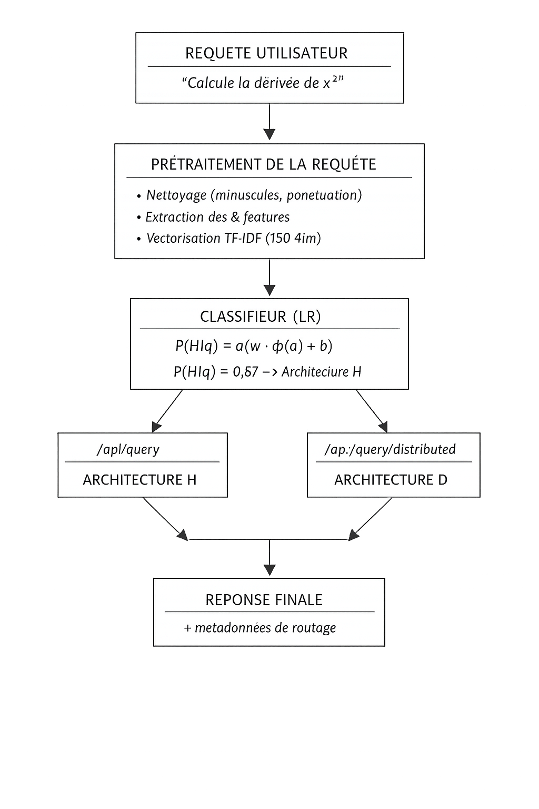
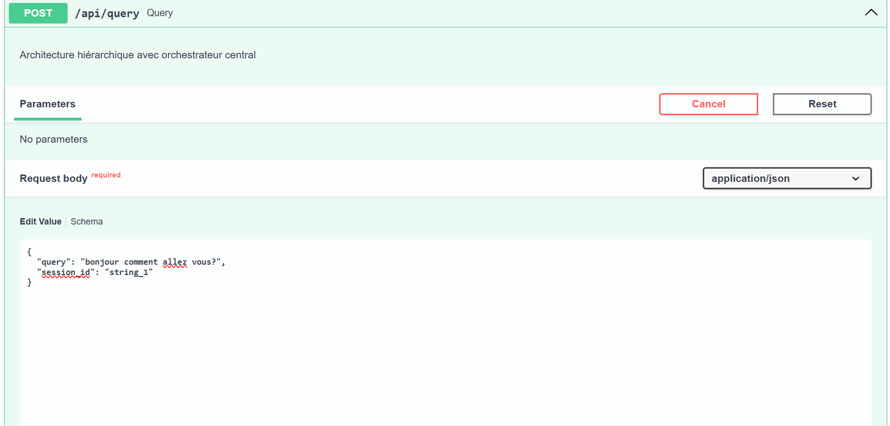
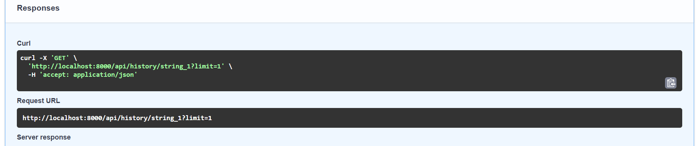
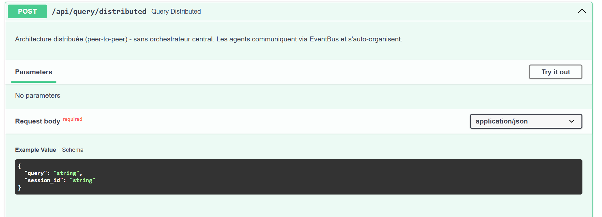
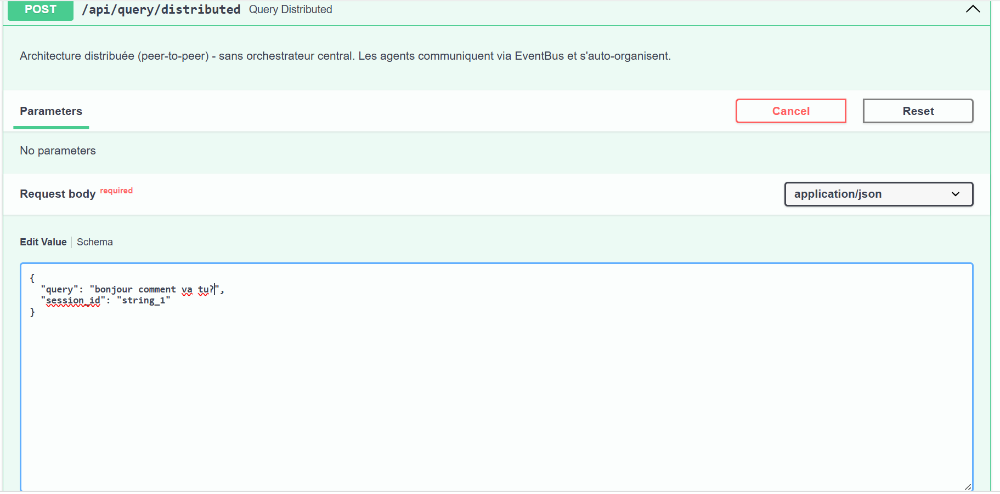

# 6. Mécanisme de routage intelligent

## 6.1 Principe du Meta-Router

Le **Meta-Router** est le composant central de l'étude expérimentale. Son rôle est d'analyser chaque requête utilisateur **avant** l'exécution et de sélectionner automatiquement l'architecture la plus adaptée entre les deux disponibles :

- **Architecture hiérarchique (H)** — orchestrateur LangGraph centralisé
- **Architecture distribuée (D)** — pipeline peer-to-peer par événements

Il s'agit d'un **classifieur supervisé léger** (Régression Logistique) entraîné sur un dataset réel de 107 questions académiques annotées. Il offre une inférence en moins d'**1 ms**, sans risque d'hallucination et avec une explicabilité totale.

> Le Meta-Router n'est **pas** une troisième architecture. Il fait partie du même pipeline unifié et agit uniquement comme un sélecteur intelligent entre les deux architectures existantes.

**Fichier principal :** `backend/meta_router/meta_router.py`

### Vue d'ensemble de l'architecture complète

> 📌 *Schéma complet du système (Meta-Router + deux architectures)*



---

## 6.2 Signaux utilisés pour la décision

Le classifieur reçoit en entrée un vecteur de features `Φ(q) ∈ ℝ¹⁵⁸` construit à partir de la requête brute en langage naturel. Ce vecteur combine :

### Features structurelles (3 dimensions)
- `len_chars` — longueur en caractères
- `len_words` — longueur en mots
- Longueur moyenne des mots

### Features lexicales (5 dimensions)
- Présence de mots-clés mathématiques
- Présence de verbes d'action
- Présence de formules ou expressions symboliques
- Présence de caractères spéciaux
- Présence de chiffres

### Features TF-IDF (150 dimensions)

```
TF-IDF(t, q) = tf(t, q) × log(N / df(t))
```

Paramètres : `max_features=150`, `ngram_range=(1,2)` — bigrammes inclus pour capturer les patterns multi-mots.

Le vecteur final concatène **8 features manuelles + 150 features TF-IDF = 158 dimensions**.

### Signaux de décision résumés

| Signal | Description | Orientation |
| :--- | :--- | :--- |
| Complexité de la requête | Niveau de raisonnement requis | Multi-étapes → **Hiérarchique** |
| Présence de formules mathématiques | Calcul symbolique détecté | → **Hiérarchique** |
| Besoin de parallélisme | Recherche multi-sources indépendantes | → **Distribuée** |
| Tâche de génération de code | Question de programmation | → **Distribuée** |
| Contraintes de latence | Question simple, réponse courte attendue | → **Distribuée** |
| Raisonnement logique séquentiel | Décomposition en sous-étapes | → **Hiérarchique** |

---

## 6.3 Stratégies de décision

### Pipeline de classification supervisée

Le Meta-Router exécute le pipeline suivant pour chaque requête entrante :

```
Requête (texte brut)
      ↓
Nettoyage (minuscules, ponctuation, stopwords)
      ↓
Extraction Φ(q) : features manuelles + TF-IDF
      ↓
Classifieur : P(H | Φ(q)) > 0.5 ?
      ↓              ↓
 Hiérarchique    Distribuée
      ↓              ↓
 Exécution     Exécution
      ↓              ↓
       Réponse finale
```

Le pipeline complet est sérialisé via `joblib` et chargé au démarrage du serveur.

### Formalisation mathématique

Pour une requête `q`, la décision est :

```
g(Φ(q)) = H   si P(H | Φ(q)) > 0.5
           D   sinon
```

Le coût multi-dimensionnel optimisé est :

```
C(q, A) = α·T(q,A) + β·(1 − Q(q,A)) + γ·Tok(q,A) + δ·(1 − Conf(q,A))
```

avec les poids empiriques : `α=0.15`, `β=0.40`, `γ=0.15`, `δ=0.15`.

### Performances du classifieur

Cinq classifieurs ont été comparés contre quatre baselines de référence :

| Modèle | Acc. test | F1 macro | ROC-AUC | CV F1 | Gap |
| :--- | :---: | :---: | :---: | :---: | :---: |
| **Régression Logistique** ✅ | **0.815** | **0.747** | 0.714 | 0.526 | −0.156 |
| CatBoost | 0.815 | 0.667 | 0.686 | 0.455 | 0.109 |
| Random Forest | 0.741 | 0.533 | 0.764 | 0.475 | 0.235 |
| XGBoost | 0.667 | 0.400 | 0.643 | 0.486 | 0.300 |
| Gradient Boosting | 0.704 | 0.451 | 0.671 | 0.461 | 0.312 |
| *Baseline Always-H* | *0.741* | *0.426* | — | — | — |
| *Baseline Rule-Based* | *0.667* | *0.512* | — | — | — |
| *Baseline Random* | *0.519* | *0.341* | — | — | — |

> La Régression Logistique dépasse la meilleure baseline (Always-H) de **+0.321 en F1-macro**. Le gap négatif (−0.156) confirme l'absence de surapprentissage.

### Traitement du déséquilibre de classes

Le dataset présente un déséquilibre naturel : **81 questions hiérarchiques (75.7%)** vs **26 questions distribuées (24.3%)**. Le Meta-Router applique **SMOTE** pour équilibrer les classes avant l'entraînement :

```
x_new = x_i + λ · (x_i^(nn) − x_i),   λ ~ U(0,1)
```

Avec `k=3` voisins, on obtient **122 échantillons équilibrés (61 par classe)**.

---

## 6.4 Exemple concret de routage — Architecture hiérarchique

### Requête envoyée

> 📌 *Interface de test — envoi de la requête en mode hiérarchique*



```bash
curl -X POST http://localhost:8000/api/query \
  -H "Content-Type: application/json" \
  -d '{"query": "bonjour comment allez vous?", "architecture": "hierarchical"}'
```

### Décision de routage interne

```json
"router_decision": {
  "selected_agents": ["planning", "rag", "verification", "synthesis"],
  "reasoning": "planning systématique | recherche documentaire détectée | vérification multi-sources | synthèse finale",
  "estimated_complexity": "low",
  "context_load": 0.419
}
```

Le routeur interne identifie une complexité **low** et active 4 agents sur 5 (le `ToolsAgent` est exclu car aucun calcul ou outil externe n'est requis).

### Trace d'exécution des agents

| Agent | Latence (ms) | Confiance | Statut |
| :--- | :---: | :---: | :---: |
| `planning` | 452.62 | 0.85 | ✅ |
| `rag` | 2 199.81 | 0.85 | ✅ |
| `tools` | 298.79 | 0.85 | ✅ *(skippé — aucun outil requis)* |
| `verification` | 3 501.19 → 16 537.29 | 0.80 | ✅ |
| `synthesis` | 4 874.47 → 11 276.73 | 0.85 | ✅ |
| **Total** | **39 181.10** | **0.80** | ✅ |

> La vérification et la synthèse apparaissent deux fois dans les `agent_results` — c'est le comportement normal de l'orchestrateur LangGraph qui effectue un second passage après la vérification initiale pour consolider la réponse finale.

### Rapport de vérification

```json
"verification_report": {
  "confidence_score": 0.80,
  "consistency_check": "Cohérent",
  "potential_hallucinations": [],
  "missing_information": [],
  "quality_score": 0.90,
  "recommendation": "PROCEED",
  "verification_notes": "La réponse est cohérente avec les informations fournies et répond directement à la question. Les références à Erving Goffman sont pertinentes et ajoutent de la valeur à la réponse."
}
```

### Réponse et historique de session

> 📌 *Réponse finale affichée + historique de session*



### Réponse JSON complète

>  *Payload JSON complet retourné par l'API*

<details>
<summary> Voir le JSON complet</summary>

```json
{
  "session_id": "string_1",
  "run_id": "f1d48507-8f19-4911-9dc3-e27302e11afd",
  "query": "bonjour comment allez vous?",
  "router_decision": {
    "selected_agents": ["planning", "rag", "verification", "synthesis"],
    "reasoning": "planning systématique | recherche documentaire détectée | vérification multi-sources | synthèse finale",
    "estimated_complexity": "low",
    "context_load": 0.419
  },
  "verification_report": {
    "confidence_score": 0.80,
    "consistency_check": "Cohérent",
    "potential_hallucinations": [],
    "missing_information": [],
    "quality_score": 0.90,
    "recommendation": "PROCEED"
  },
  "total_latency_ms": 39181.10,
  "errors": []
}
```

</details>

---

## 6.5 Exemple concret de routage — Architecture distribuée (P2P)

### Requête envoyée

> 📌 *Interface de test — envoi de la requête en mode distribué*





```bash
curl -X POST http://localhost:8000/api/query \
  -H "Content-Type: application/json" \
  -d '{"query": "bonjour comment va tu?", "architecture": "p2p"}'
```

### Décision de routage interne

```json
"router_decision": {
  "estimated_complexity": "low"
}
```

En architecture P2P, la décision de routage est **implicite** — elle est encodée dans la topologie des abonnements de l'`EventBus`. Il n'y a pas de routeur centralisé ; le `PeerToPeerRunner` publie `QUERY_RECEIVED` et les agents réagissent selon leurs abonnements.

### Rapport de vérification

```json
"verification_report": {
  "confidence_score": 0.80,
  "consistency_check": "Cohérent",
  "potential_hallucinations": [],
  "missing_information": [],
  "quality_score": 0.90,
  "recommendation": "PROCEED",
  "verification_notes": "La question est simple et le plan d'action est clair. La réponse devrait être polie et courtoise. Pas de risque de hallucination ou d'information manquante."
}
```

### Réponse JSON complète

<details>
<summary>Voir le JSON complet — architecture distribuée</summary>

```json
{
  "session_id": "string_1",
  "run_id": "3c094dc4-6f5a-4545-8efa-013c1699c534",
  "query": "bonjour comment va tu?",
  "architecture": "peer_to_peer",
  "plan": "**Stratégie :** Répondre de manière polie et courtoise en rappelant la formule de politesse\n**Complexité :** low\n**Étapes :**\n  1. Analyser la question pour comprendre le contexte\n  2. Rappeler que la question 'Comment allez-vous ?' est une formule de politesse\n  3. Proposer une réponse appropriée en fonction du contexte",
  "retrieved_docs": "",
  "tool_results": "Aucun outil externe requis pour cette question.",
  "router_decision": {
    "estimated_complexity": "low"
  },
  "verification_report": {
    "confidence_score": 0.80,
    "consistency_check": "Cohérent",
    "potential_hallucinations": [],
    "missing_information": [],
    "quality_score": 0.90,
    "recommendation": "PROCEED"
  },
  "agent_results": [],
  "total_latency_ms": 13536.70,
  "errors": []
}
```

</details>

---

## 6.6 Comparaison directe des deux exécutions

La même question de politesse (*complexité low*) a été soumise aux deux architectures. Voici les métriques comparées :

| Métrique | Hiérarchique | Distribuée (P2P) |
| :--- | :---: | :---: |
| `run_id` | `f1d48507...` | `3c094dc4...` |
| Agents activés | 4 (planning, rag, tools, verification, synthesis) | Pipeline réactif complet |
| `confidence_score` | 0.80 | 0.80 |
| `quality_score` | 0.90 | 0.90 |
| `recommendation` | PROCEED | PROCEED |
| `consistency_check` | Cohérent | Cohérent |
| `total_latency_ms` | **39 181 ms** | **13 537 ms** |
| `retrieved_docs` | Réponse documentée générée | *(vide — aucun doc indexé)* |
| `agent_results` détaillés | ✅ 7 entrées avec latences | ❌ tableau vide |
| Hallucinations détectées | Aucune | Aucune |

> **Observation clé :** Sur une requête de complexité *low*, l'architecture distribuée est **~2.9× plus rapide** (13 537 ms vs 39 181 ms). La qualité et la confiance sont identiques. Ce résultat est cohérent avec les données expérimentales du dataset (latence moyenne P2P ~2 700 ms vs ~3 200 ms pour hiérarchique). La différence ici est plus marquée car l'architecture hiérarchique a effectué deux passages complets (verification + synthesis × 2).

---

## 6.7 Visualisation et suivi des décisions de routage

Toutes les décisions de routage, métriques d'exécution et résultats par architecture sont enregistrés dans la base SQLite `./data/memory.db` pour analyse statistique et amélioration continue du Meta-Router.

### Accès aux statistiques globales

```bash
GET /api/stats
```

```json
{
  "total_conversations": 42,
  "by_architecture": {
    "hierarchical": {
      "count": 21,
      "avg_confidence": 0.84,
      "avg_latency_ms": 3200
    },
    "p2p": {
      "count": 21,
      "avg_confidence": 0.87,
      "avg_latency_ms": 2700
    }
  },
  "meta_router_accuracy": 0.76
}
```

### Accès à l'historique de session

```python
from backend.memory.memory_manager import memory_manager

# Historique des 10 dernières conversations d'une session
history = memory_manager.persistent.get_session_history("session-id", limit=10)

# Statistiques globales comparatives
stats = memory_manager.get_stats()
# → {"total_conversations": 42, "avg_confidence": 0.84, "avg_latency_ms": 3200}
```

### Protocole expérimental recommandé

Pour construire un corpus d'évaluation robuste et améliorer le Meta-Router :

1. **Catégoriser les questions** : factuelle, calculatoire, multi-sources, raisonnement complexe, code
2. **Exécuter chaque question N=10 fois** sur les deux architectures pour mesurer la variance
3. **Annoter manuellement** la qualité des réponses (ou utiliser un LLM-judge)
4. **Calculer les deltas** : Δconfidence, Δlatency, Δquality par catégorie
5. **Réentraîner le Meta-Router** sur ces nouvelles données et mesurer le gain en précision

### Métriques collectées par run

| Métrique | Source | Description |
| :--- | :--- | :--- |
| `latency_ms` | Tous les agents | Temps d'exécution par agent |
| `total_latency_ms` | Runner | Temps total bout en bout |
| `confidence_score` | VerificationAgent | Score global [0, 1] |
| `quality_score` | VerificationAgent | Qualité perçue [0, 1] |
| `consistency_check` | VerificationAgent | Cohérent / Partiel / Incohérent |
| `architecture` | Runner | `"hierarchical"` ou `"p2p"` |
| `tokens.total_tokens` | Tous les agents | Consommation totale de tokens |
| `errors` | Runner | Liste des erreurs rencontrées |


## **Ressources du projet**

Afin de faciliter la compréhension, la reproductibilité et la poursuite de la lecture de ce projet de recherche, l’ensemble des ressources utilisées est mis à disposition ci-dessous.

### **Questions d’étude (160 questions brutes par architecture)**

[Accéder aux questions d’étude](https://drive.google.com/file/d/1KxcRF8VK9NqW_yjPUW-WgKlcsN5eL6b4/view)

---

### **Dataset – Architecture hiérarchique (résultats annotés)**

[Accéder au dataset hiérarchique](https://drive.google.com/file/d/1dcOwou6JVUA68kl5kPCj0jiz2jEOUPop/view)

---

### **Dataset – Architecture distribuée (résultats annotés)**

[Accéder au dataset distribué](https://drive.google.com/file/d/1HHVlSkyogRWjRE2g1GrIuNCG4xcSZ1sb/view)

---

### **Notebook d’expérimentation**

(Prétraitement, entraînement, évaluation et étude d’ablation)

[Ouvrir le notebook d’expérimentation](https://drive.google.com/file/d/1FDWvlUyVW47MFLkkxf3gtsI1Q7Rd7Zs3/view)

---

### **Meilleur modèle retenu (pipeline sérialisé – Joblib)**

[Télécharger le modèle joblib](https://drive.google.com/file/d/1WbaPRPV0YPI0Ex_daTexzFJF0g5arV27/view)

---

## **Dépôt GitHub officiel**

Le code source complet du projet est disponible sur le dépôt GitHub officiel suivant :

[Accéder au dépôt GitHub](https://github.com/hinimdoumorsia/MultiAgentStudyArchitecture)