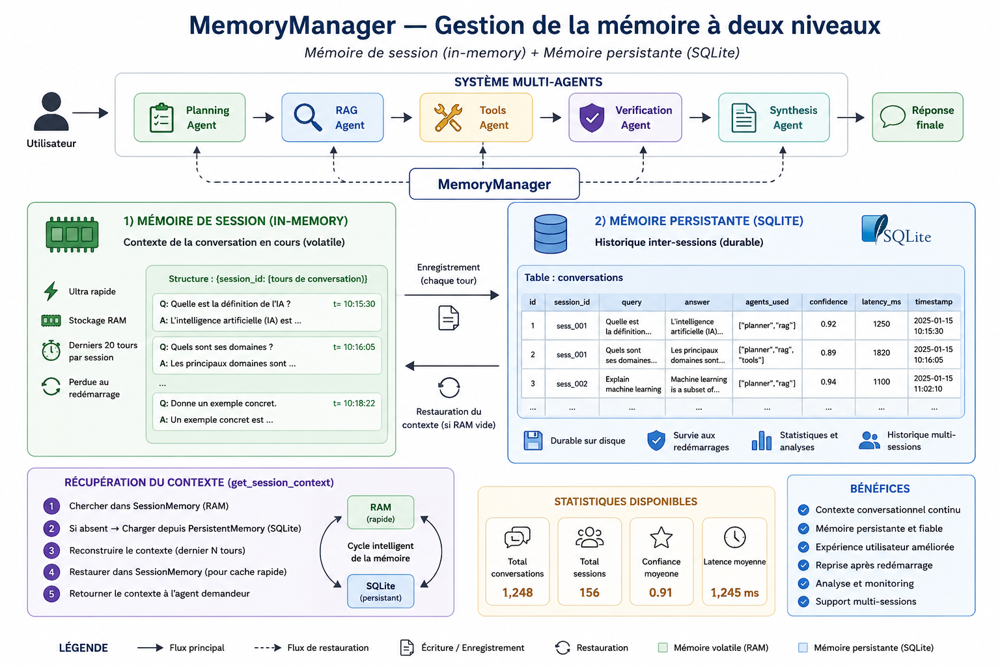
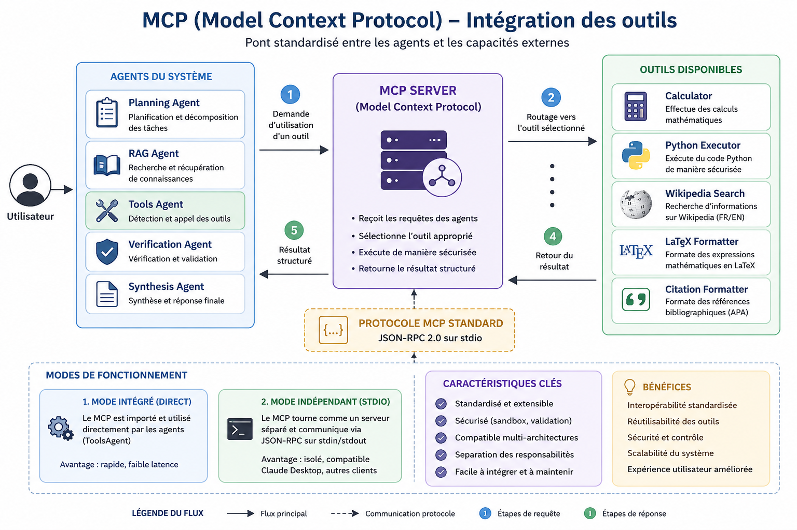

# 7. Mémoire et infrastructure

## 7.1 Mémoire de session (`SessionMemory`)

### Principe

La mémoire de session est un **dictionnaire Python en mémoire vive (RAM)**. Elle stocke les derniers tours de conversation d'une session active pour garantir la cohérence conversationnelle immédiate — permettant à chaque agent de connaître le contexte des échanges précédents dans la même session.

**Fichier :** `backend/memory/memory_manager.py` — classe `SessionMemory`

### Caractéristiques

| Propriété | Valeur |
| :--- | :--- |
| Type | Dictionnaire Python in-memory |
| Durée de vie | Durée du processus serveur (perdue au redémarrage) |
| Capacité | **20 derniers tours** par session |
| Accès | Ultra-rapide (RAM) |
| Usage | Cohérence conversationnelle immédiate |

### Interface

```python
from backend.memory.memory_manager import memory_manager

# Ajouter un tour de conversation
memory_manager.session.add_turn(
    session_id="session-xyz",
    query="Qu'est-ce que le théorème de Bayes ?",
    answer="Le théorème de Bayes est...",
    metadata={"confidence": 0.85}
)

# Récupérer l'historique complet d'une session
history = memory_manager.session.get_history("session-xyz")

# Récupérer les 3 derniers tours formatés pour le contexte agent
context = memory_manager.session.get_context_string("session-xyz", last_n=3)
# → "Q: ...\nA: ...\nQ: ...\nA: ..."

# Lister toutes les sessions actives
sessions = memory_manager.session.list_sessions()

# Effacer une session
memory_manager.session.clear_session("session-xyz")
```

### Format d'un tour

```python
{
    "timestamp": 1718000000.0,    # Unix timestamp
    "query": "Question posée...", # Tronquée à 200 chars dans le contexte
    "answer": "Réponse...",       # Tronquée à 300 chars dans le contexte
    "metadata": {}                # Données libres (confiance, agents, etc.)
}
```

---

## 7.2 Mémoire persistante (`PersistentMemory`)

### Principe

La mémoire persistante est une **base de données SQLite** stockée dans `./data/memory.db`. Elle survit aux redémarrages du serveur et constitue la source de vérité pour l'historique complet des conversations, les métriques de recherche et les données d'entraînement du Meta-Router.

> 📌 *Vue de la mémoire dans l'application*



**Fichier :** `backend/memory/memory_manager.py` — classe `PersistentMemory`

### Caractéristiques

| Propriété | Valeur |
| :--- | :--- |
| Type | SQLite (`./data/memory.db`) |
| Durée de vie | **Permanente** — survit aux redémarrages |
| Usage | Historique complet, métriques comparatives, données Meta-Router |
| Indexation | Index sur `session_id` pour les requêtes rapides |

### Schéma de la base

```sql
CREATE TABLE IF NOT EXISTS conversations (
    id          INTEGER PRIMARY KEY AUTOINCREMENT,
    session_id  TEXT NOT NULL,
    run_id      TEXT,
    query       TEXT NOT NULL,
    answer      TEXT,
    agents_used TEXT,          -- JSON array : ["planning", "rag", "synthesis"]
    confidence  REAL,
    latency_ms  REAL,
    timestamp   TEXT NOT NULL, -- ISO 8601
    metadata    TEXT           -- JSON object libre
);

CREATE INDEX IF NOT EXISTS idx_session ON conversations(session_id);
```

### Interface

```python
from backend.memory.memory_manager import memory_manager

# Sauvegarder une conversation
memory_manager.persistent.save_conversation(
    session_id="session-xyz",
    run_id="f1d48507-8f19-4911-9dc3-e27302e11afd",
    query="Explique le théorème de Bayes.",
    answer="Le théorème de Bayes stipule que...",
    agents_used=["planning", "rag", "verification", "synthesis"],
    confidence=0.85,
    latency_ms=3200.0,
    metadata={"architecture": "hierarchical"}
)

# Récupérer l'historique d'une session (10 derniers tours)
history = memory_manager.persistent.get_session_history("session-xyz", limit=10)

# Statistiques globales comparatives
stats = memory_manager.persistent.get_stats()
# → {
#     "total_conversations": 42,
#     "avg_confidence": 0.84,
#     "avg_latency_ms": 3200.1,
#     "total_sessions": 7
#   }
```

---

## 7.3 `MemoryManager` — La façade unifiée

### Principe

`MemoryManager` est la **façade** qui combine les deux niveaux de mémoire. C'est le seul composant que les agents et l'orchestrateur utilisent directement. Il expose une interface unifiée `record()` qui écrit simultanément dans les deux mémoires.

```python
# Enregistrement en une seule ligne — écrit en RAM + SQLite
memory_manager.record(
    session_id="session-xyz",
    run_id="f1d48507...",
    query="Question...",
    answer="Réponse...",
    agents_used=["planning", "rag", "synthesis"],
    confidence=0.85,
    latency_ms=3200.0,
)
```

### 🔴 Fonctionnalité clé : Restauration automatique après redémarrage

La méthode `get_session_context()` implémente un mécanisme de **récupération intelligente à deux niveaux** :

```
get_session_context(session_id)
        │
        ▼
  SessionMemory (RAM) — historique disponible ?
        │ OUI → retourner le contexte immédiatement (ultra-rapide)
        │
        ▼ NON (après redémarrage, RAM vide)
        │
  PersistentMemory (SQLite) — historique disponible ?
        │ OUI → charger depuis SQLite
        │       → restaurer dans SessionMemory (cache pour les prochains appels)
        │       → retourner le contexte
        │
        ▼ NON
  Aucun historique → retourner ""
```

```python
def get_session_context(self, session_id: str, last_n: int = 3) -> str:
    # ÉTAPE 1 : Chercher en RAM (rapide)
    context = self.session.get_context_string(session_id, last_n)
    if context:
        return context

    # ÉTAPE 2 : Fallback SQLite (après redémarrage)
    history = self.persistent.get_session_history(session_id, limit=last_n)
    if history:
        lines = []
        for turn in history:
            lines.append(f"Q: {turn['query'][:200]}")
            lines.append(f"A: {turn['answer'][:300]}")
        context = "\n".join(lines)

        # Restaurer dans SessionMemory pour les prochains appels
        for turn in history:
            self.session.add_turn(session_id, turn['query'], turn['answer'])

        return context

    return ""
```

> **Ce mécanisme garantit que les agents se souviennent des conversations précédentes même après un redémarrage complet du serveur.** La mémoire SQLite sert de filet de sécurité permanent.

---

### 🔴 TEST EN CONDITIONS RÉELLES — Démonstration de la mémoire persistante

Voici comment observer ce mécanisme en action sur l'API FastAPI :

#### Étape 1 — Lancer le serveur et envoyer une première requête

Démarrez le serveur FastAPI :

```bash
python -m uvicorn backend.main:app --reload --port 8000
```

Puis, dans Swagger UI (`http://localhost:8000/docs`) ou via curl, choisissez la méthode **POST** sur `/api/query` avec l'architecture **distribuée** et un `session_id` fixe — comme illustré ci-dessous :

> 📌 *Interface Swagger — test architecture distribuée avec session_id fixe*


```bash
curl -X POST http://localhost:8000/api/query \
  -H "Content-Type: application/json" \
  -d '{
    "query": "Bonjour, je m'\''appelle Hinimdou Morsia",
    "architecture": "p2p",
    "session_id": "ma-session-test-123"
  }'
```

Le serveur répond, et la conversation est immédiatement sauvegardée dans `./data/memory.db`.

#### Étape 2 — Arrêter le serveur

```bash
# Ctrl+C pour arrêter uvicorn
# La RAM est effacée — SessionMemory est vide
```

#### Étape 3 — Relancer le serveur et se reconnecter avec le même `session_id`

```bash
python -m uvicorn backend.main:app --reload --port 8000
```

```bash
curl -X POST http://localhost:8000/api/query \
  -H "Content-Type: application/json" \
  -d '{
    "query": "Te souviens-tu de mon prénom ?",
    "architecture": "p2p",
    "session_id": "ma-session-test-123"
  }'
```

> **L'agent se souvient de vous.** Même si la RAM a été effacée au redémarrage, `MemoryManager.get_session_context()` détecte que la `SessionMemory` est vide, charge automatiquement l'historique depuis SQLite, le restaure en RAM, et le transmet aux agents — qui peuvent alors faire référence aux échanges précédents.

---

## 7.4 Serveur MCP (Model Context Protocol)

### Principe

Le module `backend/mcp/` implémente un **vrai serveur MCP** conforme au protocole standard (JSON-RPC sur stdio). Il fournit les outils externes aux agents du système et peut fonctionner dans deux modes :

1. **Mode direct (intégré)** — utilisé par le `ToolsAgent` via import Python
2. **Mode stdio** — serveur indépendant pour des clients externes (Claude Desktop, etc.)

> 📌 *Vue du serveur MCP dans l'application*



**Fichier principal :** `backend/mcp/server.py`

**Import :**

```python
from backend.mcp import mcp_server
```

### Outils pré-enregistrés

| Outil | Description | Entrée |
| :--- | :--- | :--- |
| `calculator` | Calcul d'expressions mathématiques (`sqrt`, `**`, etc.) | `expression: string` |
| `python_executor` | Exécution Python sécurisée en sandbox | `code: string` |
| `wikipedia_search` | Résumés Wikipedia FR/EN | `query: string` |
| `latex_formatter` | Formate une expression en LaTeX (`$$...$$`) | `expression: string` |
| `citation_formatter` | Génère une citation APA | `citation: string` |

### Interface d'utilisation

```python
from backend.mcp import mcp_server

# Appeler un outil directement
result = mcp_server.call_tool("calculator", {"expression": "sqrt(144)"})
# → "Résultat : 12.0"

result = mcp_server.call_tool("wikipedia_search", {"query": "intelligence artificielle"})
# → "[Wikipedia FR] Intelligence artificielle:\n..."

result = mcp_server.call_tool("latex_formatter", {"expression": "E=mc^2"})
# → "$$E=mc^2$$"

result = mcp_server.call_tool("citation_formatter", {"citation": "Goffman, 1967"})
# → "[Goffman, 1967] (APA style)"

# Lister les outils disponibles
tools = mcp_server.list_tools()

# Récupérer un handler directement
handler = mcp_server.get_tool("calculator")
```

### Ajouter un outil personnalisé

```python
from backend.mcp import mcp_server

mcp_server.register_tool(
    name="my_tool",
    description="Description de ce que fait l'outil.",
    handler=lambda args: f"Résultat : {args.get('input', '')}",
    input_schema={
        "type": "object",
        "properties": {
            "input": {"type": "string", "description": "Paramètre d'entrée"}
        },
        "required": ["input"]
    }
)
```

### Manifeste MCP (endpoint `/api/tools/manifest`)

```json
{
  "tools": [
    {
      "name": "calculator",
      "description": "Effectue des calculs mathématiques.",
      "inputSchema": {
        "type": "object",
        "properties": {
          "expression": {"type": "string"}
        },
        "required": ["expression"]
      }
    },
    {
      "name": "python_executor",
      "description": "Exécute du code Python sécurisé.",
      "inputSchema": { "..." : "..." }
    },
    { "..." : "..." }
  ],
  "version": "1.0",
  "protocol": "MCP/1.0"
}
```

### Mode serveur stdio (client externe)

Pour utiliser le serveur MCP avec un client externe (Claude Desktop ou autre) :

```bash
python -m backend.mcp.server
```

Le serveur écoute sur `stdin` et répond sur `stdout` en JSON-RPC 2.0 :

```json
// Requête entrante
{"jsonrpc": "2.0", "method": "tools/list", "id": 1}

// Réponse
{
  "jsonrpc": "2.0",
  "result": {
    "tools": [
      {"name": "calculator", "description": "...", "inputSchema": {...}},
      {"name": "python_executor", "description": "...", "inputSchema": {...}}
    ]
  },
  "id": 1
}
```

```json
// Appel d'outil
{
  "jsonrpc": "2.0",
  "method": "tools/call",
  "params": {
    "name": "calculator",
    "arguments": {"expression": "2**10"}
  },
  "id": 2
}

// Réponse
{
  "jsonrpc": "2.0",
  "result": {
    "content": [{"type": "text", "text": "Résultat : 1024"}]
  },
  "id": 2
}
```

### Sécurité du `python_executor`

L'outil d'exécution Python intègre deux niveaux de protection :

```python
# Niveau 1 : Validation syntaxique AST avant exécution
ast.parse(code)

# Niveau 2 : Blacklist des imports et fonctions dangereuses
forbidden = ["import os", "import sys", "open(", "exec(", "eval(", "__import__"]
if any(f in code for f in forbidden):
    return "Erreur : code refusé pour des raisons de sécurité."

# Niveau 3 : Sandbox — builtins limités à un ensemble sûr
exec(code, {"__builtins__": {
    "print": print, "range": range, "len": len,
    "list": list, "dict": dict, "str": str,
    "int": int, "float": float, "sum": sum,
    "min": min, "max": max, "sorted": sorted
}})
```

---

## 7.5 Communication inter-agents (A2A)

Les deux architectures partagent les mêmes cinq agents mais utilisent des mécanismes de communication différents.

### Dans l'architecture hiérarchique — État partagé

```
PlanningAgent     →  state["plan"]                  →  RAGAgent
                                                        VerificationAgent
                                                        SynthesisAgent

RAGAgent          →  state["retrieved_docs"]         →  VerificationAgent
                                                        SynthesisAgent

ToolsAgent        →  state["tool_results"]           →  VerificationAgent
                                                        SynthesisAgent

VerificationAgent →  state["verification_report"]   →  SynthesisAgent

SynthesisAgent    →  state["final_answer"]           →  Réponse finale
```

Chaque agent lit les clés dont il a besoin dans `AcademicState` et écrit ses résultats dans sa clé dédiée. L'orchestrateur LangGraph orchestre l'ordre d'exécution.

### Dans l'architecture distribuée — Événements

```
PeerToPeerRunner  →  QUERY_RECEIVED    →  PlanningAgent
PlanningAgent     →  PLAN_CREATED      →  RAGAgent, ToolsAgent
RAGAgent          →  DOCUMENTS_FOUND   →  ToolsAgent, VerificationAgent
ToolsAgent        →  TOOL_EXECUTED     →  VerificationAgent
VerificationAgent →  VERIFICATION_DONE →  SynthesisAgent
SynthesisAgent    →  SYNTHESIS_DONE    →  (fin — débloque le runner)
N'importe lequel  →  ERROR             →  (débloque le wait, remonte l'erreur)
```

Chaque agent reconstruit un `AcademicState` complet depuis l'état agrégé du bus avant d'appeler `agent.process(state)`, garantissant que la **logique métier est identique** dans les deux architectures.

### Tableau comparatif A2A

| Aspect | Hiérarchique | Distribuée |
| :--- | :--- | :--- |
| Mécanisme | État partagé TypedDict | Publication/abonnement EventBus |
| Couplage | Fort (via état commun) | Faible (via événements) |
| Ordre | Déterministe (orchestrateur) | Réactif (topologie abonnements) |
| Parallélisme | Non | Oui (selon graphe d'événements) |
| Transparence | Totale (état lisible) | Distribuée (événements éparpillés) |
| Reconstruction état | N/A | Automatique depuis bus agrégé |


## **Ressources du projet**

Afin de faciliter la compréhension, la reproductibilité et la poursuite de la lecture de ce projet de recherche, l’ensemble des ressources utilisées est mis à disposition ci-dessous.

### **Questions d’étude (160 questions brutes par architecture)**

[Accéder aux questions d’étude](https://drive.google.com/file/d/1KxcRF8VK9NqW_yjPUW-WgKlcsN5eL6b4/view)

---

### **Dataset – Architecture hiérarchique (résultats annotés)**

[Accéder au dataset hiérarchique](https://drive.google.com/file/d/1dcOwou6JVUA68kl5kPCj0jiz2jEOUPop/view)

---

### **Dataset – Architecture distribuée (résultats annotés)**

[Accéder au dataset distribué](https://drive.google.com/file/d/1HHVlSkyogRWjRE2g1GrIuNCG4xcSZ1sb/view)

---

### **Notebook d’expérimentation**

(Prétraitement, entraînement, évaluation et étude d’ablation)

[Ouvrir le notebook d’expérimentation](https://drive.google.com/file/d/1FDWvlUyVW47MFLkkxf3gtsI1Q7Rd7Zs3/view)

---

### **Meilleur modèle retenu (pipeline sérialisé – Joblib)**

[Télécharger le modèle joblib](https://drive.google.com/file/d/1WbaPRPV0YPI0Ex_daTexzFJF0g5arV27/view)

---

## **Dépôt GitHub officiel**

Le code source complet du projet est disponible sur le dépôt GitHub officiel suivant :

[Accéder au dépôt GitHub](https://github.com/hinimdoumorsia/MultiAgentStudyArchitecture)